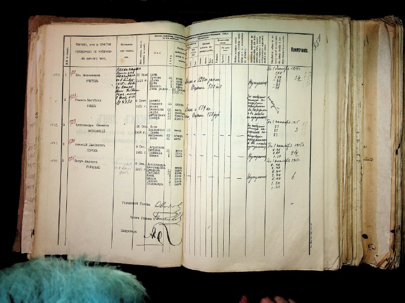

+++
title = ""
date = 2026-04-14T20:26:05+00:00
description = "preservation century19 scan hand Source"

[taxonomies]
days = ["2026-04-14"]
tags = ["preservation", "century19", "scan", "hand"]

[extra]
id = 1637
day = "2026-04-14"
tg_url = "https://t.me/vitaly_zdanevich_chan/1637"
og_image = "01.jpg"
next_id = 1640
next_title = ""
next_body = "#firefox\n#webextension: after #tab close - switch to the previously active tab"
prev_id = 1636
prev_title = ""
prev_body = "#linux\n#france\n#news\nFrance to ditch Windows for Linux to reduce reliance on US tech\nFrance is trying to move on from Microsoft Windows. The country said it plans to move some of its government computers currently running Windows to the open source operating system Linux to further reduce its reliance on U.S. technology.\nLinux is an open source operating system that is free to download and use, with various customized distributions that are tailored and designed for specific use cases or operations.\nIn a statement, French minister David Amiel said (translated) that the effort was to “regain control of our digital destiny” by relying less on U.S. tech companies. Amiel said that the French government can no longer accept that it doesn’t have control over its data and digital infrastructure."
views = 22
ids = [1637]
+++

{{ tag(t="preservation") }}  
{{ tag(t="century19") }}  
{{ tag(t="scan") }}  
{{ tag(t="hand") }}

[Source](https://commons.wikimedia.org/wiki/File:%D0%94%D0%90_%D0%92%D1%96%D0%BD%D0%BD%D0%B8%D1%86%D1%8C%D0%BA%D0%BE%D1%97_%D0%BE%D0%B1%D0%BB%D0%B0%D1%81%D1%82%D1%96--01_%D0%A4%D0%BE%D0%BD%D0%B4%D0%B8_%D0%B4%D0%BE_1917_%D1%80%D0%BE%D0%BA%D1%83--0230--010230-01-01583_image01086.jpg)

