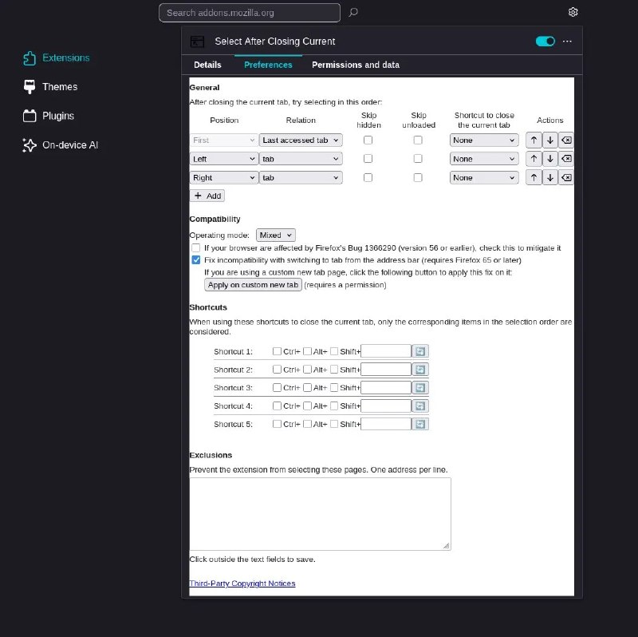

+++
title = ""
date = 2026-04-15T13:04:57+00:00
description = "firefox webextension: after tab close - switch to the previously active tab"

[taxonomies]
days = ["2026-04-15"]
tags = ["firefox", "webextension", "tab"]

[extra]
id = 1640
day = "2026-04-15"
tg_url = "https://t.me/vitaly_zdanevich_chan/1640"
og_image = "5404543896626336747_1258343434_460002283.jpg"
next_id = 1641
next_title = ""
prev_id = 1637
prev_title = ""
views = 23
ids = [1640]
+++

{{ tag(t="firefox") }}  
{{ tag(t="webextension") }}: after {{ tag(t="tab") }} close - switch to the previously active tab  

<https://addons.mozilla.org/en-US/firefox/addon/select-after-closing-current/>

