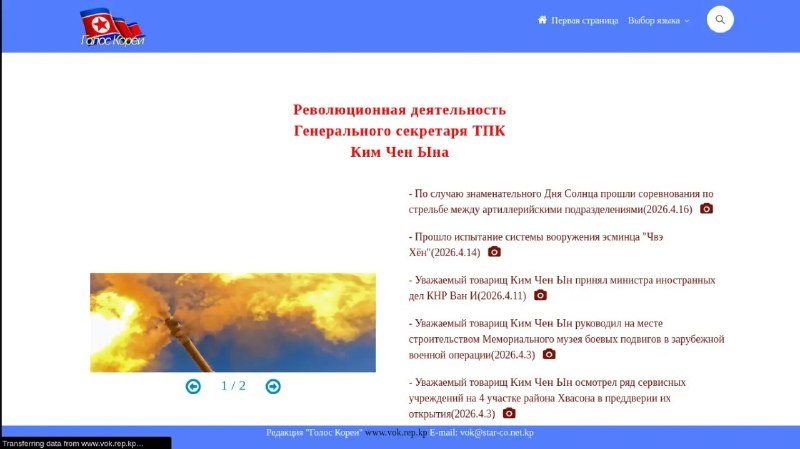

+++
title = ""
date = 2026-04-16T16:48:36+00:00
description = "webdesign northkorea radio podcast"

[taxonomies]
days = ["2026-04-16"]
tags = ["webdesign", "north_korea", "radio", "podcast"]

[extra]
id = 1645
day = "2026-04-16"
tg_url = "https://t.me/vitaly_zdanevich_chan/1645"
og_image = "01.jpg"
next_id = 1647
next_title = ""
next_body = "#captcha"
prev_id = 1641
prev_title = ""
prev_body = "#podcast\n#my\n#health\n#startup\n#geogorgiladze\nГеоргий Горгиладзе: от тяжелых болезней к выздоровлению, рекорду Гиннесса и стартапу в области HealthTech\nГость из Книги Рекордов Гиннеса, который первый в мире простоял на гвоздях 12 часов, демонстрирует экстремальные возможности человеческого тела на ТВ и международных мероприятиях, до этого много болел, 13 раз лежал в больницах, врачи запрещали физические нагрузки, что подвинуло Георгия серьёзно и самостоятельно заняться своим здоровьем, начав в 12 лет с экспериментального лечения иглоукалыванием, изучением восточной медицины и физиологии, вылечив себя самостоятельно. А сейчас делает стартап по здоровью GeoHealth\nВикипедия о госте:\nЗаписано на Gentoo Linux в ffmpeg и Audacity (в два отдельных канала), клики в аудио удалил через\n#podcast\n#northkorea\n#голоскореи\nFrom"
views = 25
ids = [1645]
+++

{{ tag(t="webdesign") }}  
{{ tag(t="north_korea") }}  
{{ tag(t="radio") }}  
{{ tag(t="podcast") }}  

<http://www.vok.rep.kp/index.php/home/main/ru>

