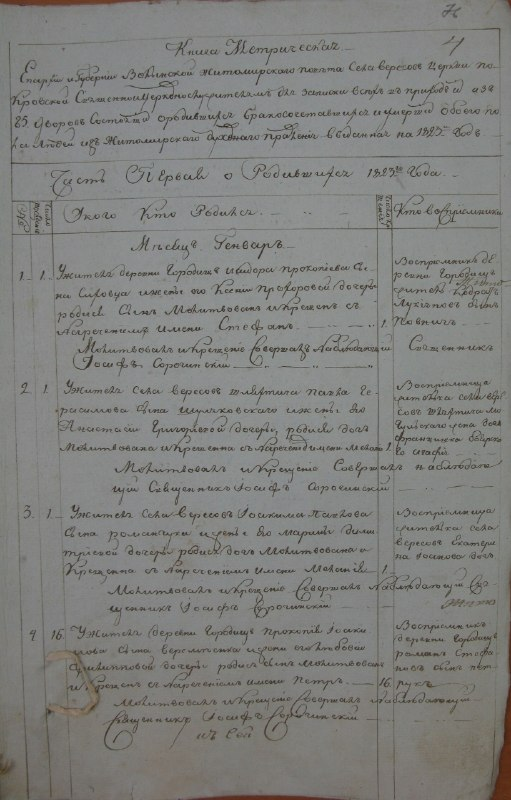
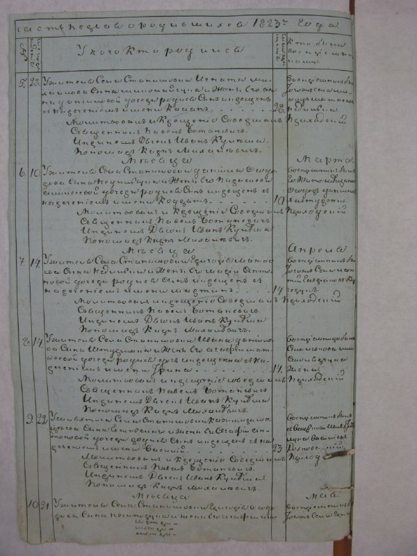
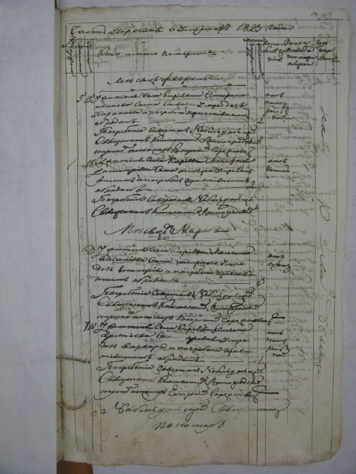
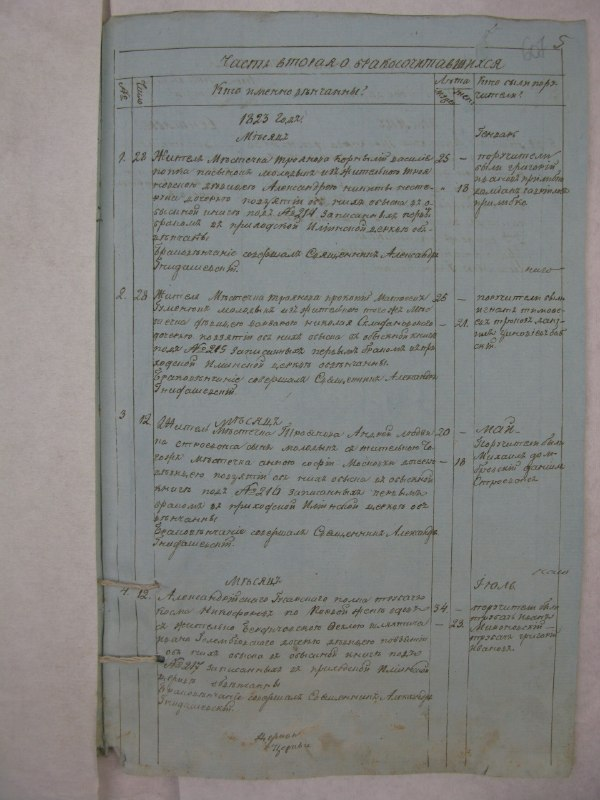
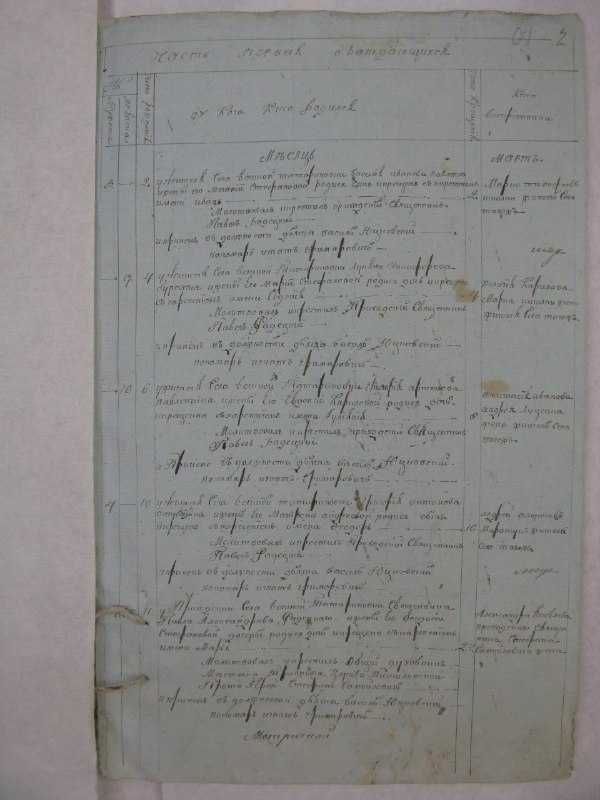

+++
title = ""
date = 2026-04-19T22:55:17+00:00
description = "typography russian preservation century19 Source"

[taxonomies]
days = ["2026-04-19"]
tags = ["typography", "russian", "preservation", "century19"]

[extra]
id = 1649
day = "2026-04-19"
tg_url = "https://t.me/vitaly_zdanevich_chan/1649"
og_image = "01.jpg"
next_id = 1654
next_title = ""
next_body = "#ai\n#hi\n#qwen\n#terminal"
prev_id = 1648
prev_title = ""
prev_body = "#music\n#calm\n[Verse]\nSo familiar and overwhelmingly warm\nThis one, this form I hold now\nEmbracing you, this reality here\nThis one, this form I hold now, so\nWide eyed and hopeful\nWide eyed and hopefully wild\nWe barely remember what came before this precious moment\nChoosing to be here right now\nHold on, stay inside\nThis body holding me\nReminding me that I am not alone in\nThis body makes me feel eternal\nAll this pain is an illusion"
views = 17
ids = [1649]
+++

{{ tag(t="typography") }}  
{{ tag(t="russian") }}  
{{ tag(t="preservation") }}  
{{ tag(t="century19") }}  

[Source](https://commons.wikimedia.org/wiki/File:%D0%94%D0%90_%D0%96%D0%B8%D1%82%D0%BE%D0%BC%D0%B8%D1%80%D1%81%D1%8C%D0%BA%D0%BE%D1%97_%D0%BE%D0%B1%D0%BB%D0%B0%D1%81%D1%82%D1%96--01_%D0%A4_-_%D1%84%D0%BE%D0%BD%D0%B4%D0%B8_%D0%B4%D0%BE%D1%80%D0%B0%D0%B4%D1%8F%D0%BD%D1%81%D1%8C%D0%BA%D0%BE%D0%B3%D0%BE_%D0%BF%D0%B5%D1%80%D1%96%D0%BE%D0%B4%D1%83--0001--0076--010001-76-00035--010001-76-00035.PDF_page158_1.jpeg)

