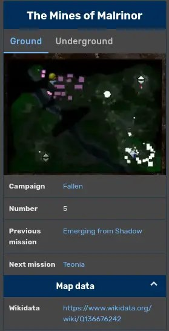
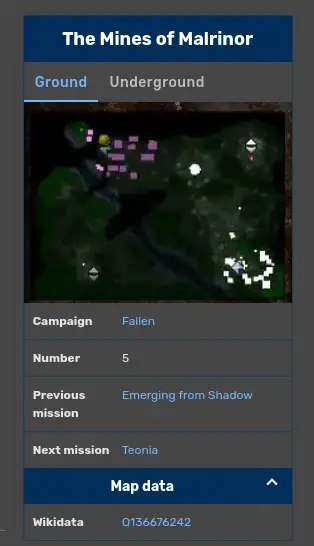

+++
title = "Before"
date = 2026-04-22T22:03:36+00:00
description = "mediawiki fandom infobox template concatenation wikidata armiesofexigo Wikidata After: Wikidata [ } }]"

[taxonomies]
tags = ["mediawiki", "fandom", "infobox", "template", "concatenation", "wikidata", "armies_of_exigo"]

[extra]
tg_url = "https://t.me/vitaly_zdanevich_chan/1672"
og_image = "01.jpg"
next_id = 1674
next_title = "ДА Житомирської області--01 Ф - фонди дорадянського періоду--0001--0075--010001-75-00033 F 1-75-0033 0390.jpg"
prev_id = 1668
prev_title = "Atelier Shallie Alchemists of the Dusk Sea"
views = 15
ids = [1672]
+++

{{ tag(t="mediawiki") }}
{{ tag(t="fandom") }}
{{ tag(t="infobox") }}
{{ tag(t="template") }}
{{ tag(t="concatenation") }}
{{ tag(t="wikidata") }}
{{ tag(t="armies_of_exigo") }}


```
<data source="wikidata">
    <label>Wikidata</label>
</data>
```

After:

```
<data source="wikidata">
    <label>Wikidata</label>
    <format>[https://www.wikidata.org/wiki/{{{wikidata}}} {{{wikidata}}}]</format>
</data>
```

<https://armies-of-exigo.fandom.com/wiki/Template:Campaign_mission?diff=7111&oldid=7110>




