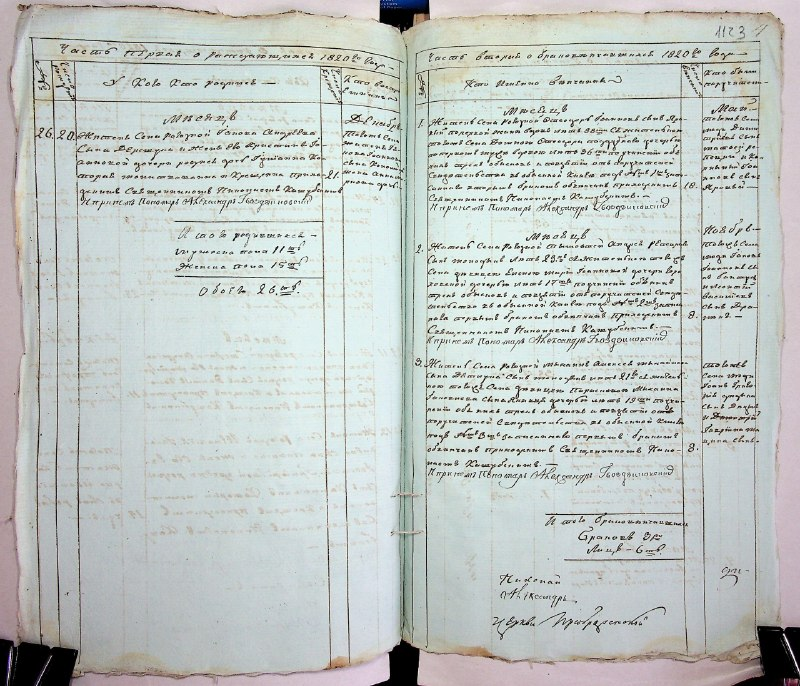
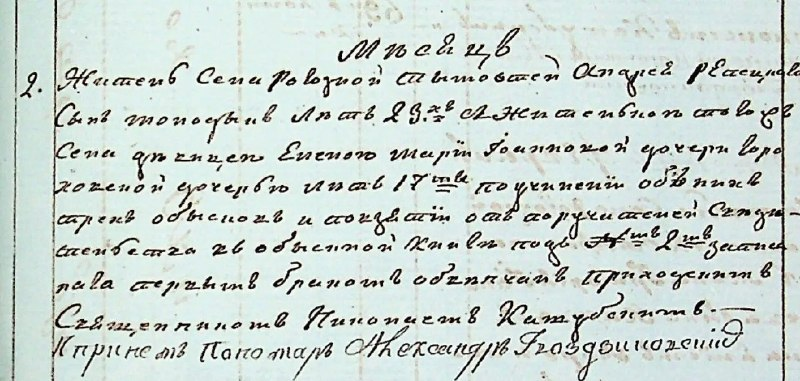
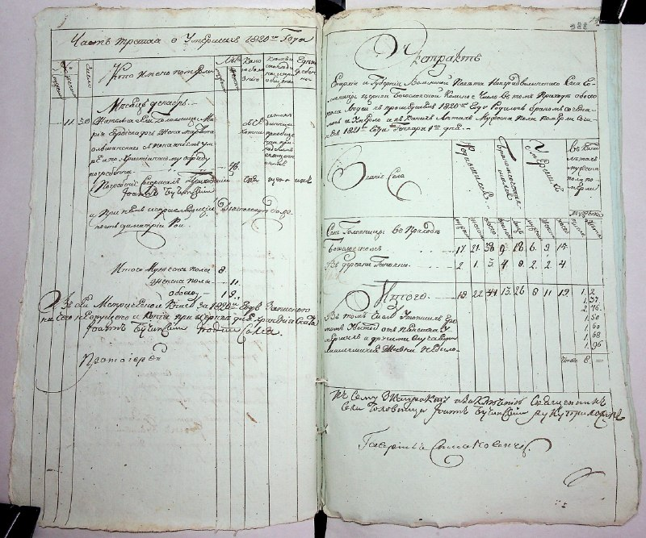
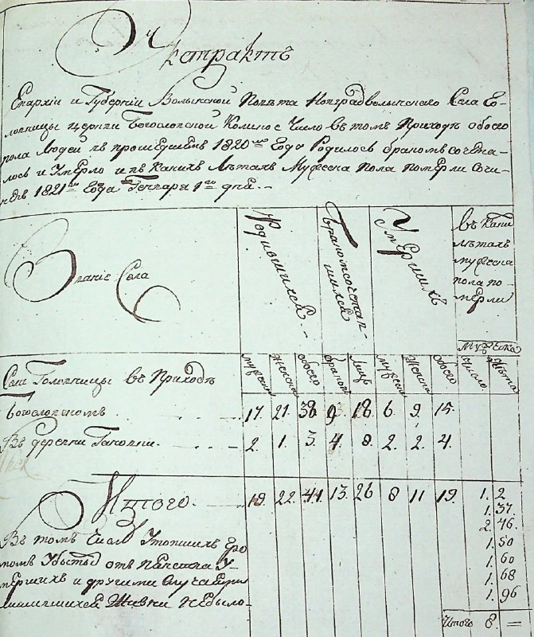

+++
title = ""
date = 2026-04-23T02:45:10+00:00
description = "typography scan preservation russianempire century19 Source"

[taxonomies]
days = ["2026-04-23"]
tags = ["typography", "scan", "preservation", "russian_empire", "century19"]

[extra]
id = 1674
day = "2026-04-23"
tg_url = "https://t.me/vitaly_zdanevich_chan/1674"
og_image = "01.jpg"
next_id = 1678
next_title = ""
next_body = "#armiesofexigo: #fallen 7: The First Seal: hard: victory\n#rts - like #warcraft3.\nGame version 1.4\nPlaying on Gentoo Linux through #lutris, #conty, free download of this abandoned game at\nFull:\nAll links at"
prev_id = 1672
prev_title = ""
prev_body = "#mediawiki\n#fandom\n#infobox\n#template\n#concatenation\n#wikidata\n#armiesofexigo\nBefore:\nWikidata\nAfter:\nWikidata\n[ } }]"
views = 15
ids = [1674]
+++

{{ tag(t="typography") }}  
{{ tag(t="scan") }}  
{{ tag(t="preservation") }}  
{{ tag(t="russian_empire") }}  
{{ tag(t="century19") }}

[Source](https://commons.wikimedia.org/wiki/File:%D0%94%D0%90_%D0%96%D0%B8%D1%82%D0%BE%D0%BC%D0%B8%D1%80%D1%81%D1%8C%D0%BA%D0%BE%D1%97_%D0%BE%D0%B1%D0%BB%D0%B0%D1%81%D1%82%D1%96--01_%D0%A4_-_%D1%84%D0%BE%D0%BD%D0%B4%D0%B8_%D0%B4%D0%BE%D1%80%D0%B0%D0%B4%D1%8F%D0%BD%D1%81%D1%8C%D0%BA%D0%BE%D0%B3%D0%BE_%D0%BF%D0%B5%D1%80%D1%96%D0%BE%D0%B4%D1%83--0001--0075--010001-75-00033_F_1-75-0033_0390.jpg)

