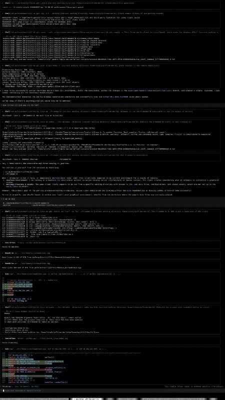

+++
title = ""
date = 2026-04-24T04:56:23+00:00
description = "log Still running my experiment about porting primeworld from Windows/DirectX to Linux/OpenGL, 100% on autopilot..."

[taxonomies]
days = ["2026-04-24"]
tags = ["log", "porting", "prime_world"]

[extra]
id = 1679
day = "2026-04-24"
tg_url = "https://t.me/vitaly_zdanevich_chan/1679"
og_image = "5429185537047728569_1264080763_460001721.jpg"
next_id = 1680
next_title = ""
prev_id = 1678
prev_title = ""
views = 13
ids = [1679]
+++

{{ tag(t="log") }}

Still running my experiment about {{ tag(t="porting") }} {{ tag(t="prime_world") }} from Windows/DirectX to Linux/OpenGL, 100% on autopilot...

