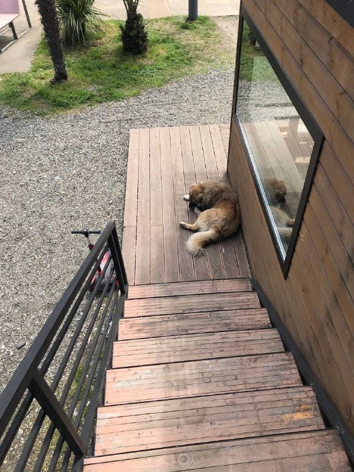

+++
title = ""
date = 2026-04-25T06:49:35+00:00
description = "photo batumi dog"

[taxonomies]
days = ["2026-04-25"]
tags = ["photo", "batumi", "dog"]

[extra]
id = 1686
day = "2026-04-25"
tg_url = "https://t.me/vitaly_zdanevich_chan/1686"
og_image = "5431547614441706367_1264630727_460002175.jpg"
next_id = 1687
next_title = ""
next_body = "#my\n#evernote\n#telegrambot\n#awslambda\n#ai\n#codex\n#gpt5\nArticle about it"
prev_id = 1685
prev_title = ""
prev_body = "#quote\n#book\n#ночьвлиссабоне\n#ремарк"
views = 17
ids = [1686]
+++

{{ tag(t="photo") }}  
{{ tag(t="batumi") }}  
{{ tag(t="dog") }}

