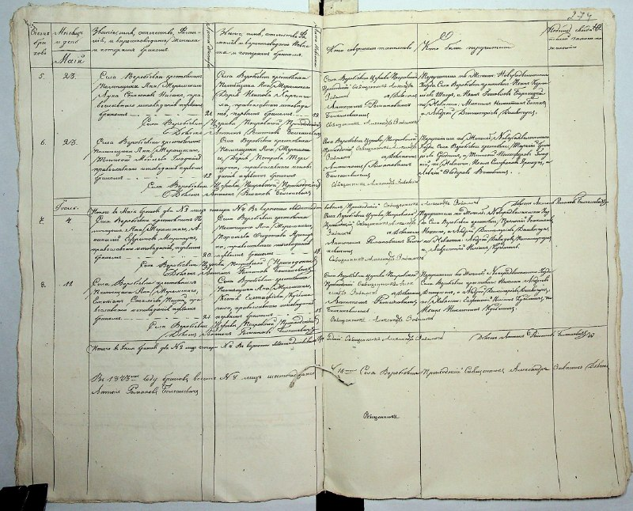
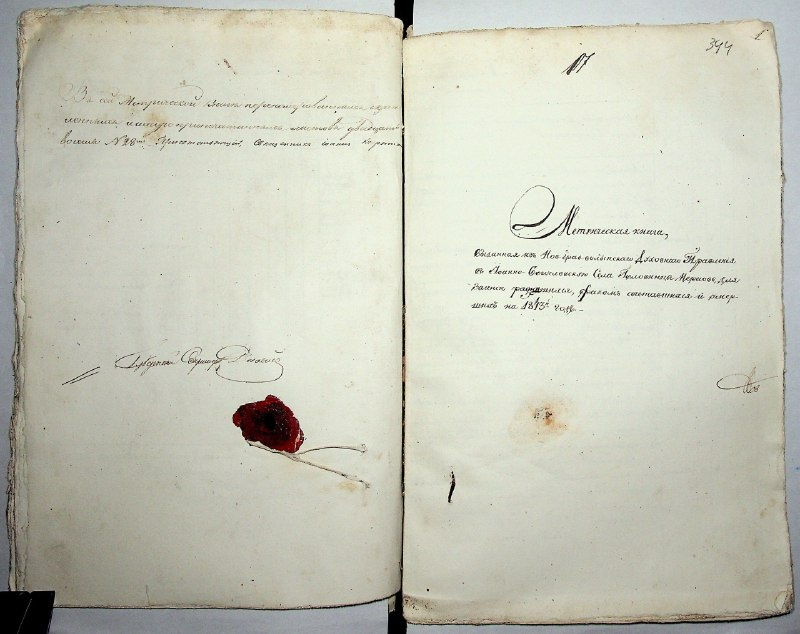
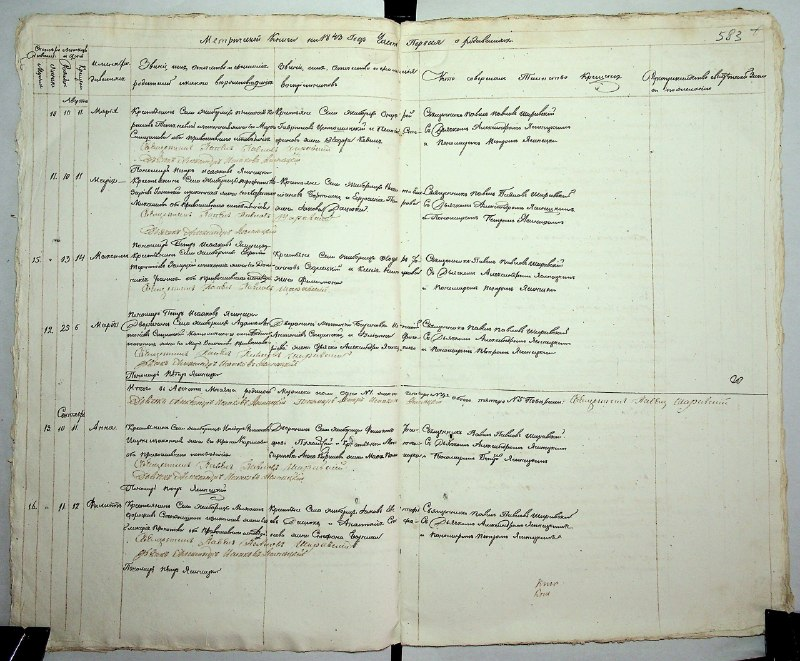
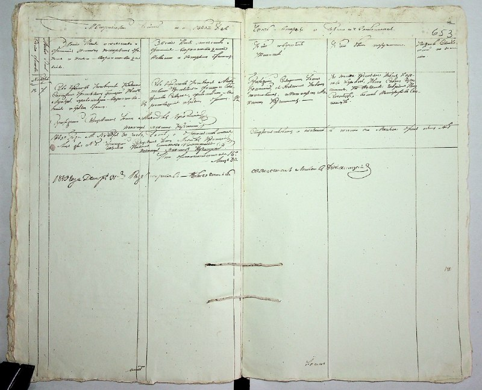
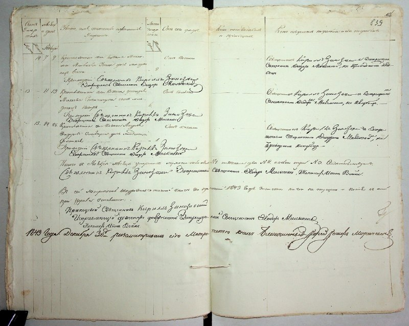
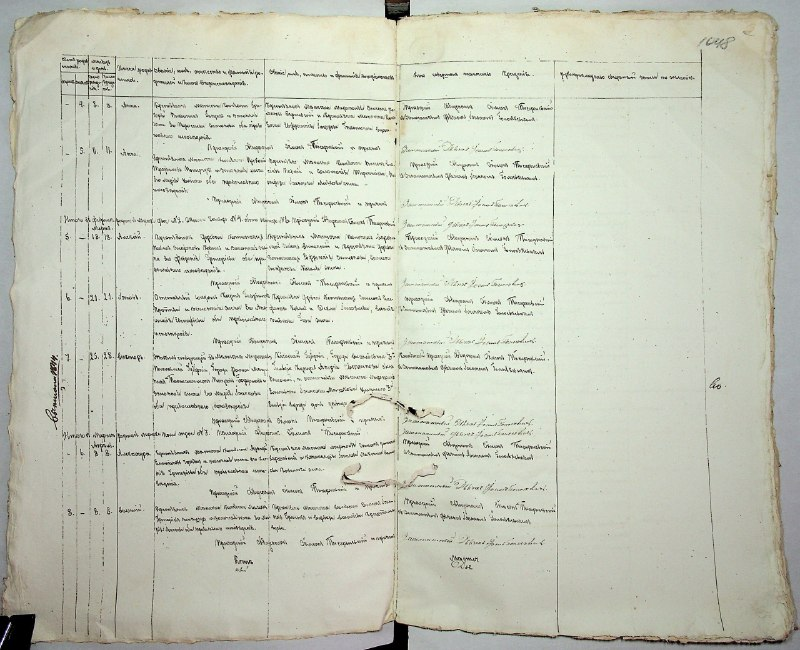

+++
title = "ДА Житомирської області--01 Ф - фонди дорадянського періоду--0001--0075--010001-75-00067 F 1-75-0067 0268.jpg"
date = 2026-04-28T14:30:55+00:00
description = "ДА Житомирської області--01 Ф - фонди дорадянського періоду--0001--0075--010001-75-00067 F 1-75-0067 0268.jpg typography scan preservation russianempire century19"

[taxonomies]
tags = ["typography", "scan", "preservation", "russian_empire", "century19"]

[extra]
tg_url = "https://t.me/vitaly_zdanevich_chan/1703"
og_image = "01.jpg"
next_id = 1709
next_title = "ДА Дніпропетровської області (Дніпро)--01--0104--010104-01-00004 image00004.jpg"
prev_id = 1695
prev_title = "my batumi restaurant art food sazandari"
views = 20
ids = [1703]
+++

[ДА Житомирської області--01 Ф - фонди дорадянського періоду--0001--0075--010001-75-00067 F 1-75-0067 0268.jpg](https://commons.wikimedia.org/wiki/File:%D0%94%D0%90_%D0%96%D0%B8%D1%82%D0%BE%D0%BC%D0%B8%D1%80%D1%81%D1%8C%D0%BA%D0%BE%D1%97_%D0%BE%D0%B1%D0%BB%D0%B0%D1%81%D1%82%D1%96--01_%D0%A4_-_%D1%84%D0%BE%D0%BD%D0%B4%D0%B8_%D0%B4%D0%BE%D1%80%D0%B0%D0%B4%D1%8F%D0%BD%D1%81%D1%8C%D0%BA%D0%BE%D0%B3%D0%BE_%D0%BF%D0%B5%D1%80%D1%96%D0%BE%D0%B4%D1%83--0001--0075--010001-75-00067_F_1-75-0067_0268.jpg)

{{ tag(t="typography") }}
{{ tag(t="scan") }}
{{ tag(t="preservation") }}
{{ tag(t="russian_empire") }}
{{ tag(t="century19") }}

