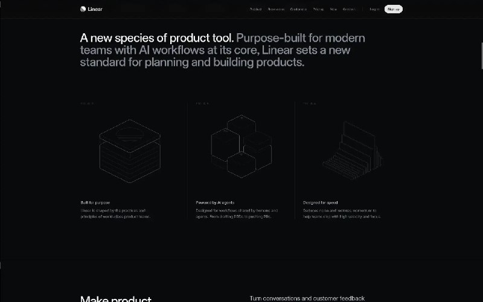
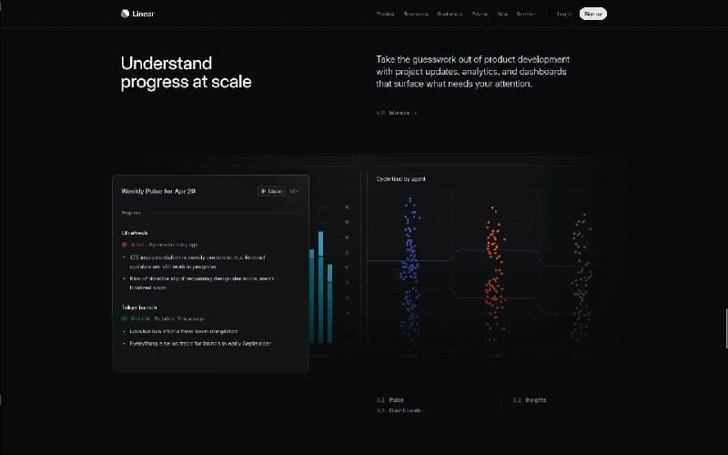

+++
title = ""
date = 2026-04-29T08:54:45+00:00
description = "webdesign dark"

[taxonomies]
days = ["2026-04-29"]
tags = ["webdesign", "dark"]

[extra]
id = 1719
day = "2026-04-29"
tg_url = "https://t.me/vitaly_zdanevich_chan/1719"
og_image = "01.jpg"
next_id = 1721
next_title = ""
next_body = "#typography\n#scan\n#preservation\n#russianempire\n#century19\nSource"
prev_id = 1709
prev_title = ""
prev_body = "#typography\n#scan\n#preservation\n#russianempire\n#century19\nSource--01--0104--010104-01-00004image00004.jpg)"
views = 20
ids = [1719]
+++

{{ tag(t="webdesign") }}  
{{ tag(t="dark") }}  

<https://linear.app/>

