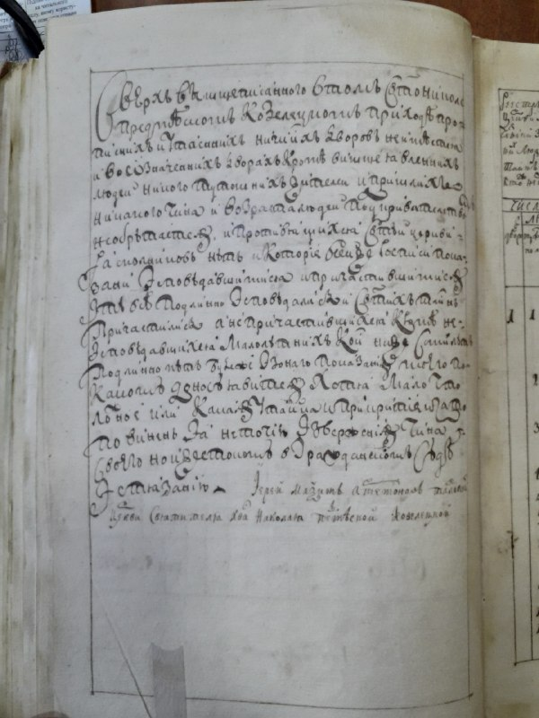
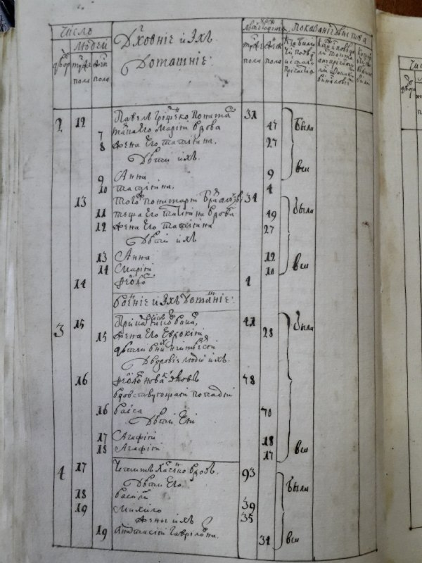
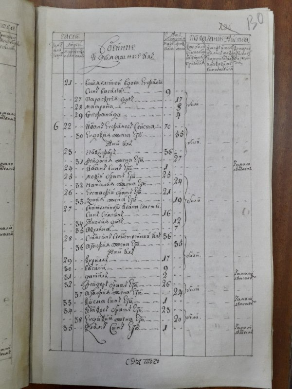
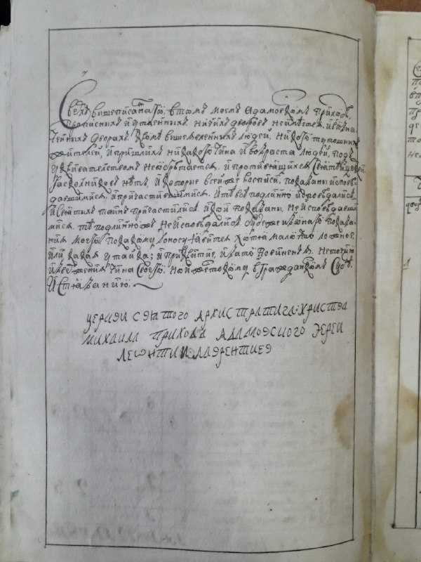
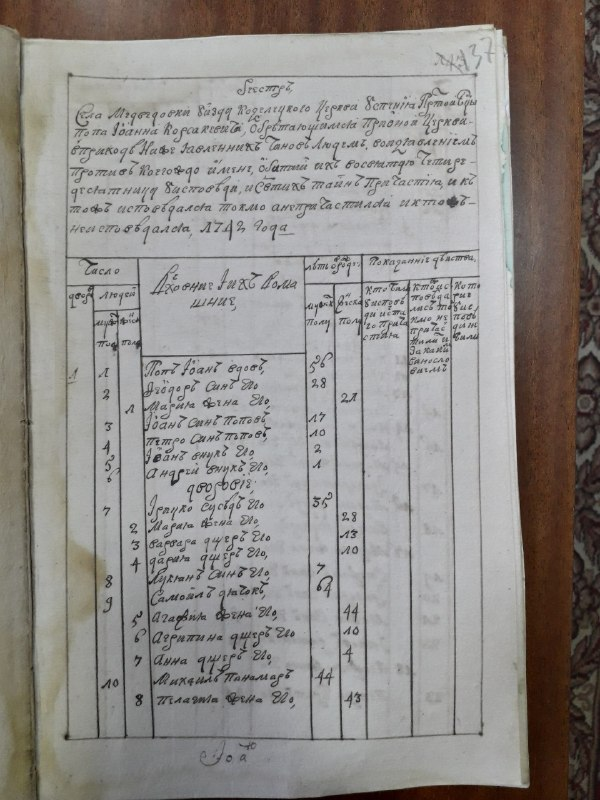
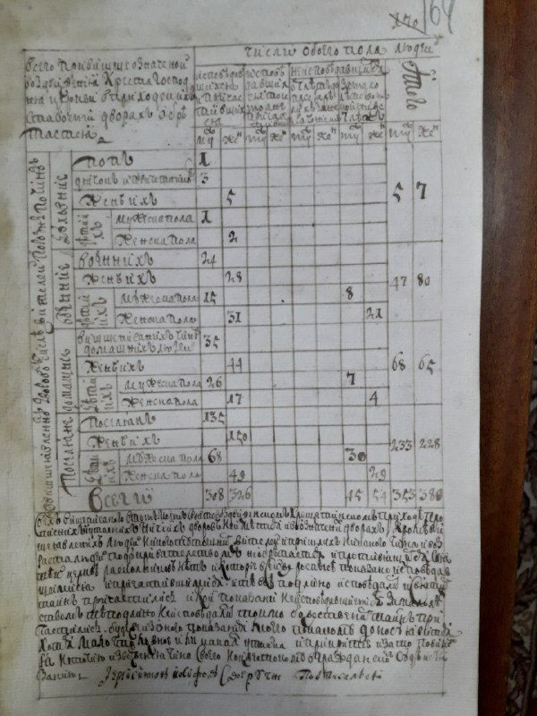
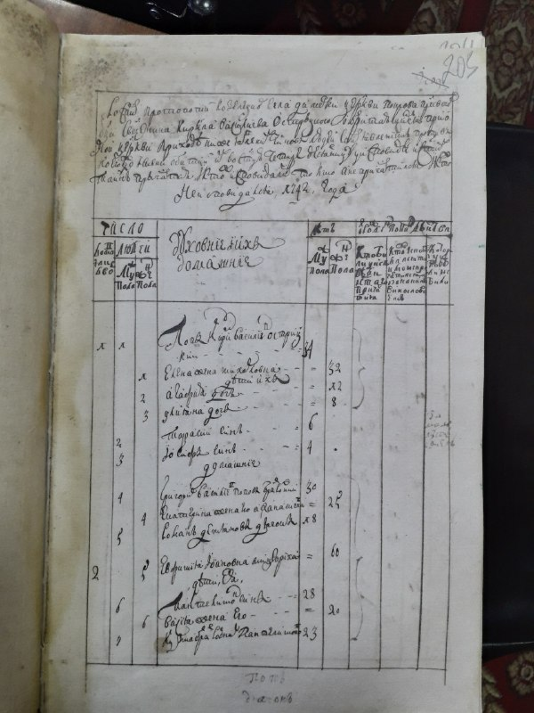
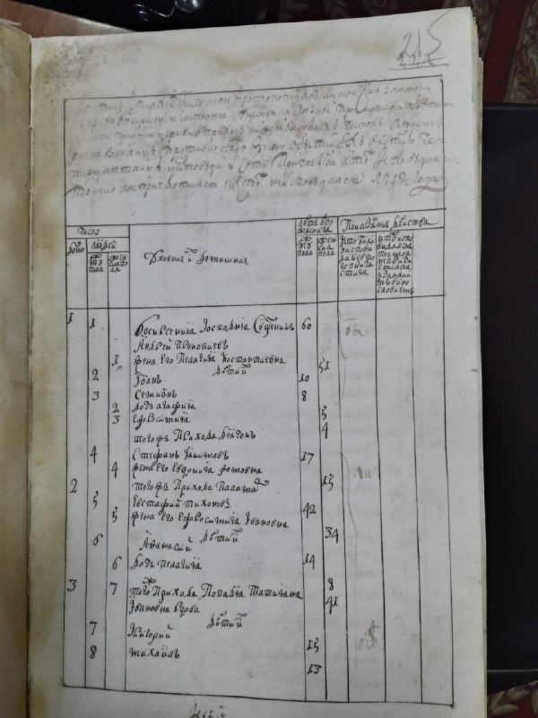

+++
title = ""
date = 2026-04-30T04:35:53+00:00
description = "typography scan preservation russianempire century19 Source"

[taxonomies]
days = ["2026-04-30"]
tags = ["typography", "scan", "preservation", "russian_empire", "century19"]

[extra]
id = 1721
day = "2026-04-30"
tg_url = "https://t.me/vitaly_zdanevich_chan/1721"
og_image = "01.jpg"
next_id = 1729
next_title = ""
next_body = "Asked #codex gpt-5.5 xhigh to rewrite #geeknote (#cli of #evernote) to #rust, a few iterations - and I got #reeknote - faster geeknote."
prev_id = 1719
prev_title = ""
prev_body = "#webdesign\n#dark"
views = 22
ids = [1721]
+++

{{ tag(t="typography") }}  
{{ tag(t="scan") }}  
{{ tag(t="preservation") }}  
{{ tag(t="russian_empire") }}  
{{ tag(t="century19") }}  

[Source](https://commons.wikimedia.org/wiki/File:%D0%94%D0%90_%D0%A7%D0%B5%D1%80%D0%BD%D1%96%D0%B3%D1%96%D0%B2%D1%81%D1%8C%D0%BA%D0%BE%D1%97_%D0%BE%D0%B1%D0%BB%D0%B0%D1%81%D1%82%D1%96--01--0679--0679-01--010679-01-01521_1742_%D1%80%D1%96%D0%BA_20200312_085419.jpg)

