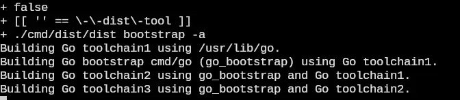

+++
title = "gentoo golang bootstrap"
date = 2026-05-03T20:32:54+00:00
description = "gentoo golang bootstrap"

[taxonomies]
tags = ["gentoo", "golang", "bootstrap"]

[extra]
tg_url = "https://t.me/vitaly_zdanevich_chan/1732"
og_image = "5456435665726806035_1270425428_460003347.jpg"
next_id = 1733
next_title = "Белорусский арабский алфавит"
prev_id = 1731
prev_title = "colors cables pole"
views = 18
ids = [1732]
+++

{{ tag(t="gentoo") }}
{{ tag(t="golang") }}
{{ tag(t="bootstrap") }}

