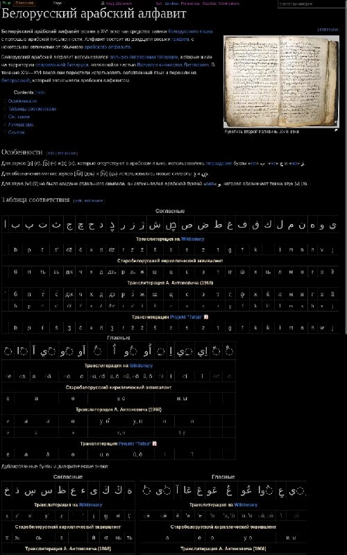

+++
title = "Белорусский арабский алфавит"
date = 2026-05-04T19:11:09+00:00
description = "Белорусский арабский алфавит belarus belarussian arabic language"

[taxonomies]
tags = ["belarus", "belarussian", "arabic", "language"]

[extra]
tg_url = "https://t.me/vitaly_zdanevich_chan/1733"
og_image = "5460766981331030706_1271433891_460001970.jpg"
next_id = 1734
next_title = "Between the Black Sea and the mountains."
prev_id = 1732
prev_title = "gentoo golang bootstrap"
views = 20
ids = [1733]
+++

[Белорусский арабский алфавит](https://ru.wikipedia.org/wiki/%D0%91%D0%B5%D0%BB%D0%BE%D1%80%D1%83%D1%81%D1%81%D0%BA%D0%B8%D0%B9_%D0%B0%D1%80%D0%B0%D0%B1%D1%81%D0%BA%D0%B8%D0%B9_%D0%B0%D0%BB%D1%84%D0%B0%D0%B2%D0%B8%D1%82)

{{ tag(t="belarus") }}
{{ tag(t="belarussian") }}
{{ tag(t="arabic") }}
{{ tag(t="language") }}

