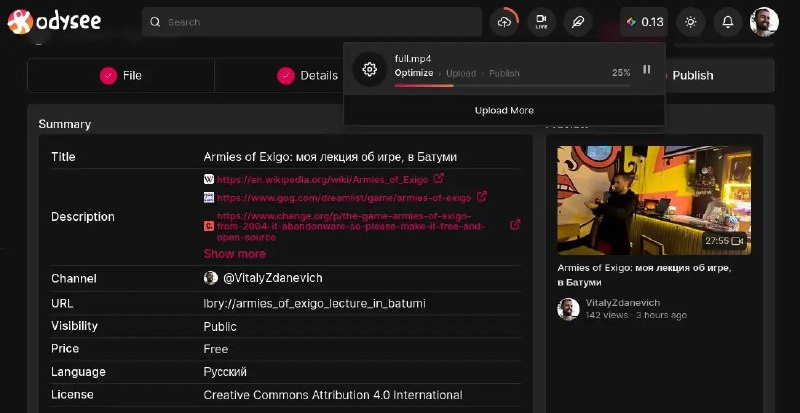

+++
title = ""
date = 2026-05-05T20:30:26+00:00
description = "odysee looks like convert video right in a browser - without uploading to the backend."

[taxonomies]
days = ["2026-05-05"]
tags = ["odysee", "convert", "video", "browser"]

[extra]
id = 1741
day = "2026-05-05"
tg_url = "https://t.me/vitaly_zdanevich_chan/1741"
og_image = "01.jpg"
next_id = 1744
next_title = ""
next_body = "#python\n#mojo\n#llm\n#gemini\n2. Mojo (The New Challenger)\nMojo is a new programming language designed by Chris Lattner (creator of LLVM and Swift).\nIt is a superset of Python that looks and feels like Python but includes optional strong, static typing.\nIt claims to be up to 35,000x faster than Python because it compiles to machine code and utilizes hardware features like SIMD.\nKey Innovations: Introduces features like let for immutable variables\nWhy not #const?"
prev_id = 1740
prev_title = ""
prev_body = "#armiesofexigo: моя #лекция об игре, в Батуми\n#stillyoungbar\nТакже скачать эту заброшенную игру можно тут\nВсе ссылки на это #видео"
views = 19
ids = [1741]
+++

{{ tag(t="odysee") }} looks like {{ tag(t="convert") }} {{ tag(t="video") }} right in a {{ tag(t="browser") }} - without uploading to the backend.

