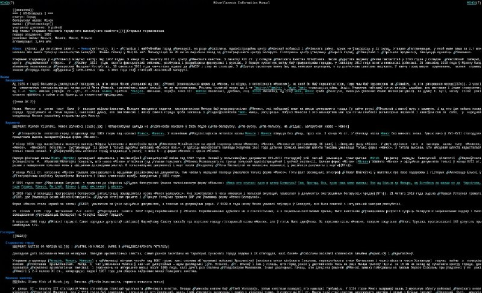

+++
title = ""
date = 2026-05-06T06:28:52+00:00
description = "My another hobby project, made with llm / codex: converter of wikipedia dumps into man / roff format, on rust (because I love performance): for a terminal, offline reading. love it, still fixing many…"

[taxonomies]
days = ["2026-05-06"]
tags = ["llm", "codex", "wikipedia", "man", "roff", "rust", "terminal", "offline", "love"]

[extra]
id = 1745
day = "2026-05-06"
tg_url = "https://t.me/vitaly_zdanevich_chan/1745"
og_image = "5465571945928660178_1272552634_460002514.jpg"
next_id = 1746
next_title = ""
prev_id = 1744
prev_title = ""
views = 23
ids = [1745]
+++

My another hobby project, made with {{ tag(t="llm") }} / {{ tag(t="codex") }}: converter of {{ tag(t="wikipedia") }} dumps into {{ tag(t="man") }} / {{ tag(t="roff") }} format, on {{ tag(t="rust") }} (because I love performance): for a {{ tag(t="terminal") }}, {{ tag(t="offline") }} reading. {{ tag(t="love") }} it, still fixing many markup cases, but mostly its readable already <https://gitlab.com/vitaly-zdanevich/wiki2man_on_rust>

Wrote about it at <https://diff.wikimedia.org/2026/06/25/i-built-the-convertor-from-wikipedia-dumps-to-man-roff-format-for-offline-reading-in-a-terminal/>

