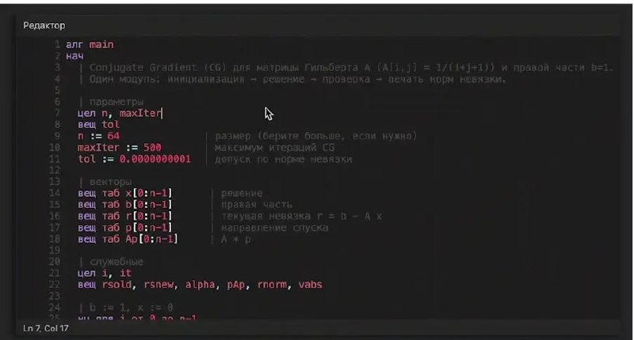
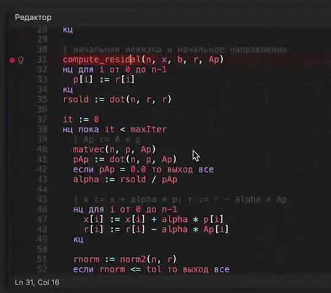

+++
title = ""
date = 2026-05-13T11:35:24+00:00
description = "code russian yandex language From"

[taxonomies]
days = ["2026-05-13"]
tags = ["code", "russian", "yandex", "language"]

[extra]
id = 1756
day = "2026-05-13"
tg_url = "https://t.me/vitaly_zdanevich_chan/1756"
og_image = "01.jpg"
next_id = 1758
next_title = ""
next_body = "Wow my #reeknote (#evernote #cli) can now play audio and show images, in a terminal"
prev_id = 1755
prev_title = ""
prev_body = "#ai\n#screenshot from"
views = 24
ids = [1756]
+++

{{ tag(t="code") }}  
{{ tag(t="russian") }}  
{{ tag(t="yandex") }}  
{{ tag(t="language") }}  

From <https://t.me/Yandex4Developers/1513>

