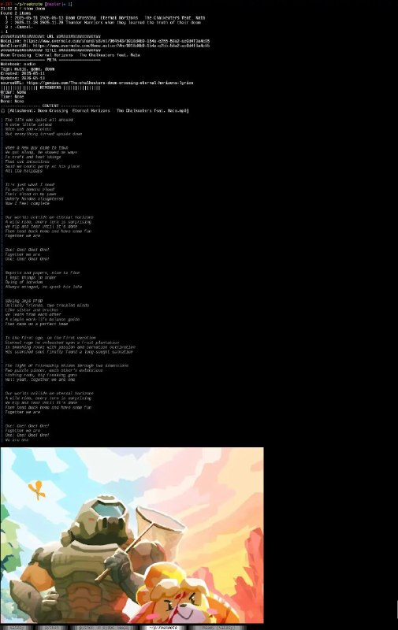

+++
title = "Wow my reeknote (evernote cli) can now play audio and show images, in a terminal"
date = 2026-05-13T17:22:31+00:00
description = "Wow my reeknote (evernote cli) can now play audio and show images, in a terminal"

[taxonomies]
tags = ["reeknote", "evernote", "cli"]

[extra]
tg_url = "https://t.me/vitaly_zdanevich_chan/1758"
og_image = "5199865542213308919_1210688041_460001783.jpg"
next_id = 1759
next_title = "Fix my style for mdn, screenshot before and after"
prev_id = 1756
prev_title = "code russian yandex language"
views = 21
ids = [1758]
+++

Wow my {{ tag(t="reeknote") }} ({{ tag(t="evernote") }} {{ tag(t="cli") }}) can now play audio and show images, in a terminal

<https://github.com/vitaly-zdanevich/reeknote>

