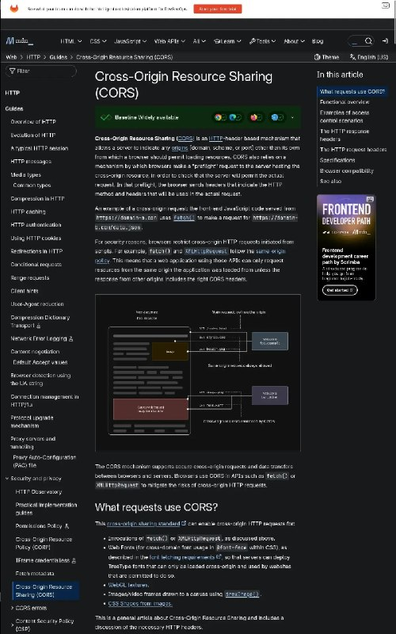
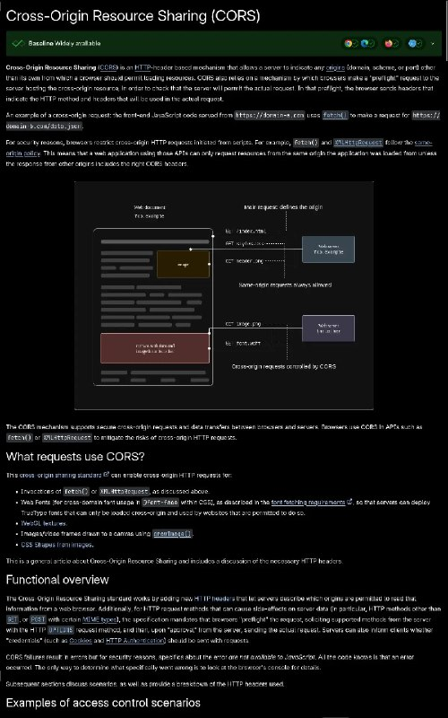

+++
title = "Fix my style for mdn, screenshot before and after"
date = 2026-05-13T19:34:25+00:00
description = "Fix my style for mdn, screenshot before and after Sad that UI customization is rare."

[taxonomies]
tags = ["style", "mdn", "screenshot"]

[extra]
tg_url = "https://t.me/vitaly_zdanevich_chan/1759"
og_image = "01.jpg"
next_id = 1761
next_title = "I love ci so much that for the first time I depleted free 400 minutes per month, on gitlab, on my FOSS non-commercial projects."
prev_id = 1758
prev_title = "Wow my reeknote (evernote cli) can now play audio and show images, in a terminal"
views = 23
ids = [1759]
+++

Fix my {{ tag(t="style") }} for {{ tag(t="mdn") }}, {{ tag(t="screenshot") }} before and after

Sad that UI customization is rare.

<https://gitlab.com/vitaly-zdanevich-styles/mdn>

