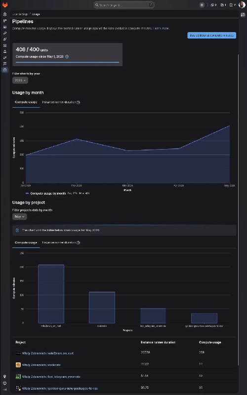

+++
title = ""
date = 2026-05-15T17:06:34+00:00
description = "I love ci so much that for the first time I depleted free 400 minutes per month, on gitlab, on my FOSS non-commercial projects."

[taxonomies]
days = ["2026-05-15"]
tags = ["ci", "gitlab"]

[extra]
id = 1761
day = "2026-05-15"
tg_url = "https://t.me/vitaly_zdanevich_chan/1761"
og_image = "5206510853052634168_1212235273_460002360.jpg"
next_id = 1762
next_title = ""
next_body = "#лекция про мой #telegram #бот для #evernote\nРепозиторий проекта:\nСоздано через #llm Codex gpt-5.5 xhigh, часов за 10. Сначала на Питоне - а потом попросил переписать на Расте - для скорости.\nУпоминались:\nevernote.com\nevernote.com/api/DeveloperToken.action\nhelp.evernote.com/hc/en-us/articles/209005347-Save-emails-into-Evernote\nnotesnook.com FOSS альтернатива\nobsidian.md проприетарный софт для заметок в markdown\nlogseq.com свободные заметки в markdown\ngithub.com/boo-yee/nixnote2 FOSS клиент для Evernote на C++ и Qt\ngithub.com/vitaly-zdanevich/reeknote мой CLI на Rust\ngithub.com/syncthing/syncthing FOSS синхронизация данных через ваши устройства\nБесплатный хостинг для ваших проектов:\naws.amazon.com/lambda\nПро стили - чтобы сайты выгляди как надо вам а не дизайнеру:\ngithub.com/openstyles/stylus\nuserstyles.world/user/vitaly-zdanevich\ngitlab.com/vitaly-zdanevich-styles/evernote\ncss-tricks.com/css-keylogger"
prev_id = 1759
prev_title = ""
prev_body = "Fix my #style for #mdn, #screenshot before and after\nSad that UI customization is rare."
views = 22
ids = [1761]
+++

I love {{ tag(t="ci") }} so much that for the first time I depleted free 400 minutes per month, on {{ tag(t="gitlab") }}, on my FOSS non-commercial projects.  

<https://gitlab.com/-/profile/usage_quotas#pipelines-quota-tab>

