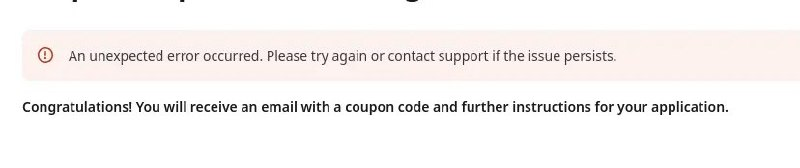

+++
title = "error gitlab contradiction"
date = 2026-05-16T12:52:42+00:00
description = "error gitlab contradiction"

[taxonomies]
tags = ["error", "gitlab", "contradiction"]

[extra]
tg_url = "https://t.me/vitaly_zdanevich_chan/1763"
og_image = "5206531314276832954_1212240037_460003002.jpg"
next_id = 1764
next_title = "Остров в океане"
prev_id = 1762
prev_title = "лекция про мой telegram бот для evernote"
views = 23
ids = [1763]
+++

{{ tag(t="error") }}
{{ tag(t="gitlab") }}
{{ tag(t="contradiction") }}

