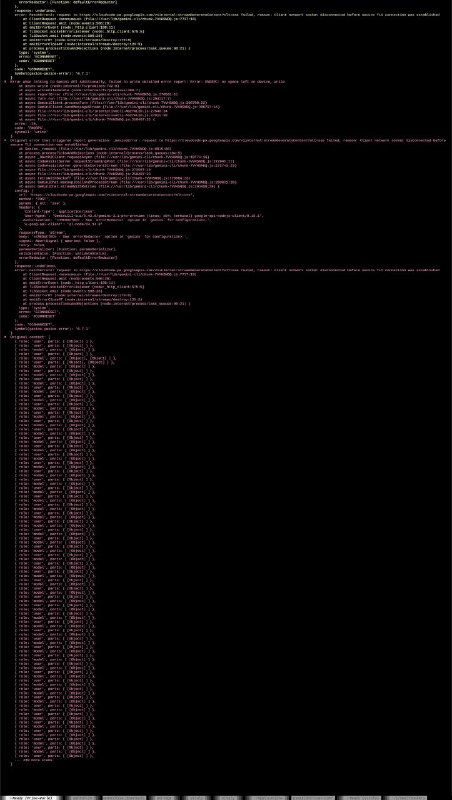
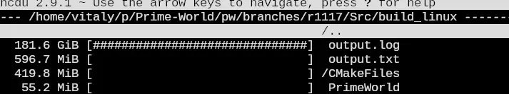

+++
title = ""
date = 2026-05-18T19:06:09+00:00
description = "log failed"

[taxonomies]
days = ["2026-05-18"]
tags = ["log"]

[extra]
id = 1777
day = "2026-05-18"
tg_url = "https://t.me/vitaly_zdanevich_chan/1777"
og_image = "01.jpg"
next_id = 1779
next_title = ""
prev_id = 1776
prev_title = ""
views = 33
ids = [1777]
+++

{{ tag(t="log") }}

failed

