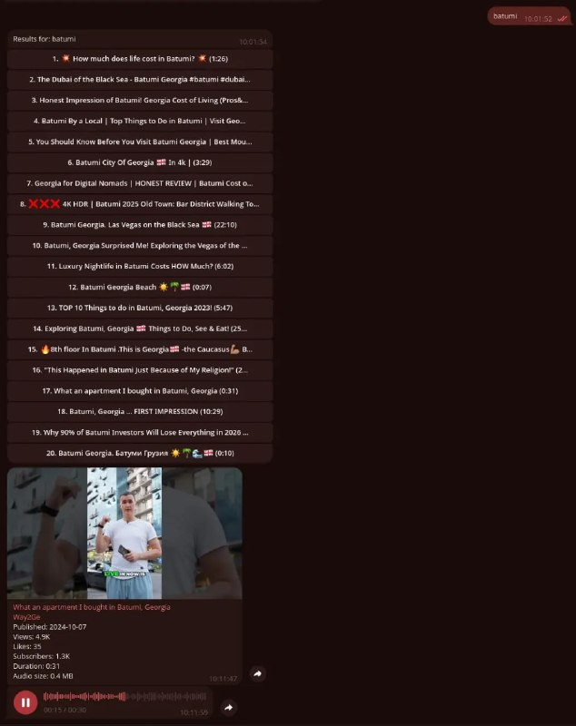

+++
title = "My new project built with llm codex gpt-5.5 xhigh: bot for telegram - to search and listen to youtube"
date = 2026-05-21T06:52:35+00:00
description = "My new project built with llm codex gpt-5.5 xhigh: bot for telegram - to search and listen to youtube"

[taxonomies]
tags = ["llm", "codex", "gpt", "bot", "telegram", "youtube"]

[extra]
tg_url = "https://t.me/vitaly_zdanevich_chan/1784"
og_image = "5222276797527956531_1215906068_460004403.jpg"
next_id = 1785
next_title = "Another llm victory: repack of the official evernote client"
prev_id = 1781
prev_title = "mem limited by the technology of my time"
views = 37
ids = [1784]
+++

My new project built with {{ tag(t="llm") }} {{ tag(t="codex") }} {{ tag(t="gpt") }}-5.5 xhigh: {{ tag(t="bot") }} for {{ tag(t="telegram") }} - to search and listen to {{ tag(t="youtube") }}

<https://gitlab.com/vitaly-zdanevich/bot_telegram_youtube>

