+++
title = "crypto wallet"
date = 2026-05-26T13:46:01+00:00
description = "Payment -&gt; crypto -&gt; Select your wallet woodev.net"

[taxonomies]
tags = ["crypto", "wallet"]

[extra]
tg_url = "https://t.me/vitaly_zdanevich_chan/1787"
og_image = "01.jpg"
next_id = 1799
next_title = "28мая2026 (чт) 21:00–01:00 — айтишная посиделка в Still Young Bar 🍻"
prev_id = 1786
prev_title = "Finally I forked nixnote, and migrated from qt5 to qt6, by llm gpt 5.5 xhigh"
views = 36
ids = [1787, 1797]
+++

> Payment -&gt; {{ tag(t="crypto") }} -&gt; Select your {{ tag(t="wallet") }}

[woodev.net](http://woodev.net/)

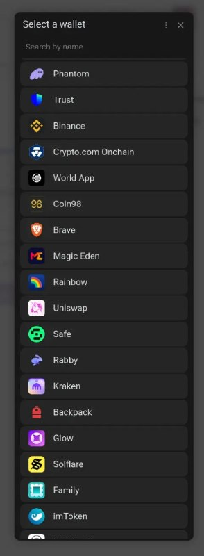

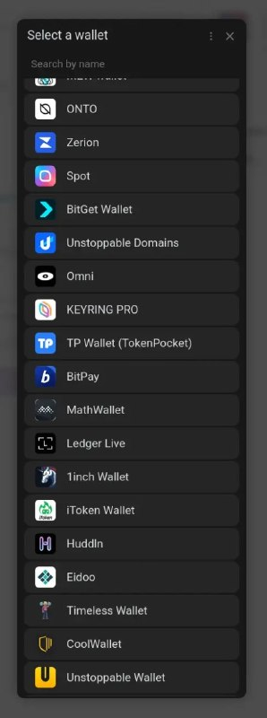

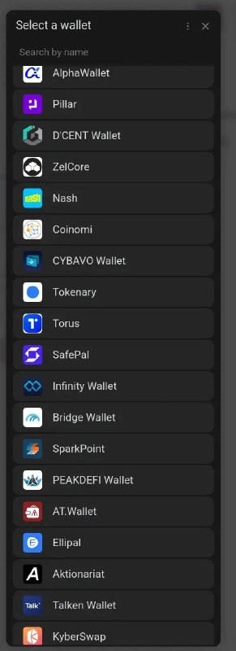

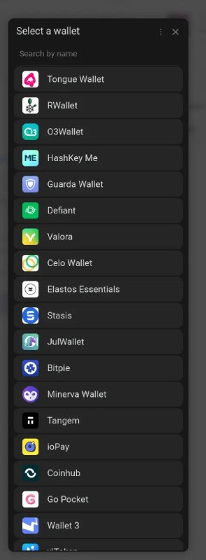

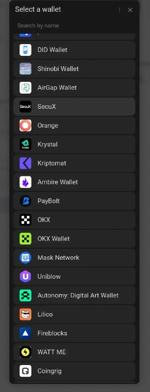

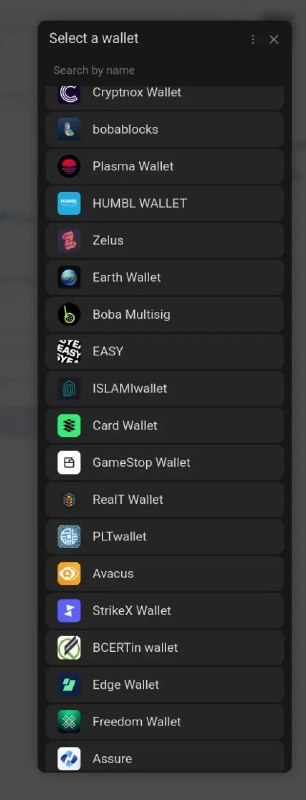

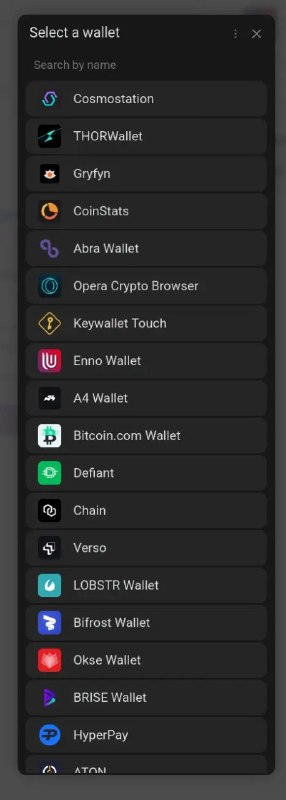

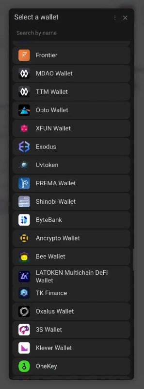

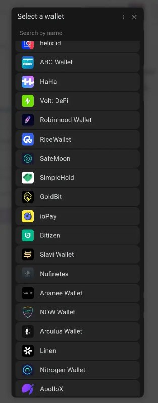

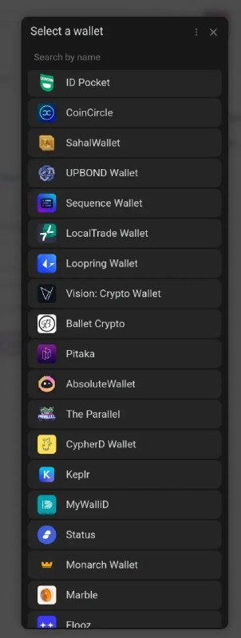

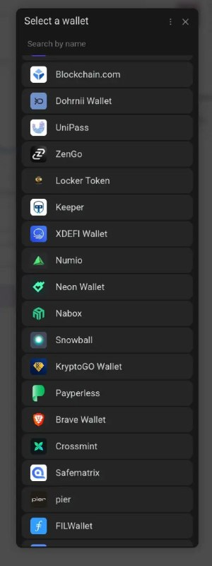

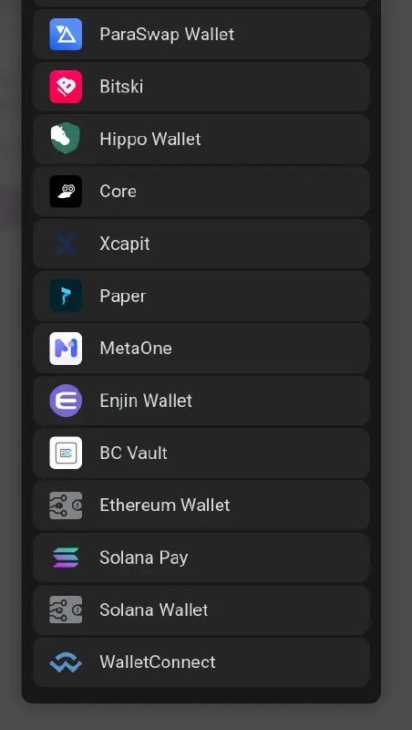
