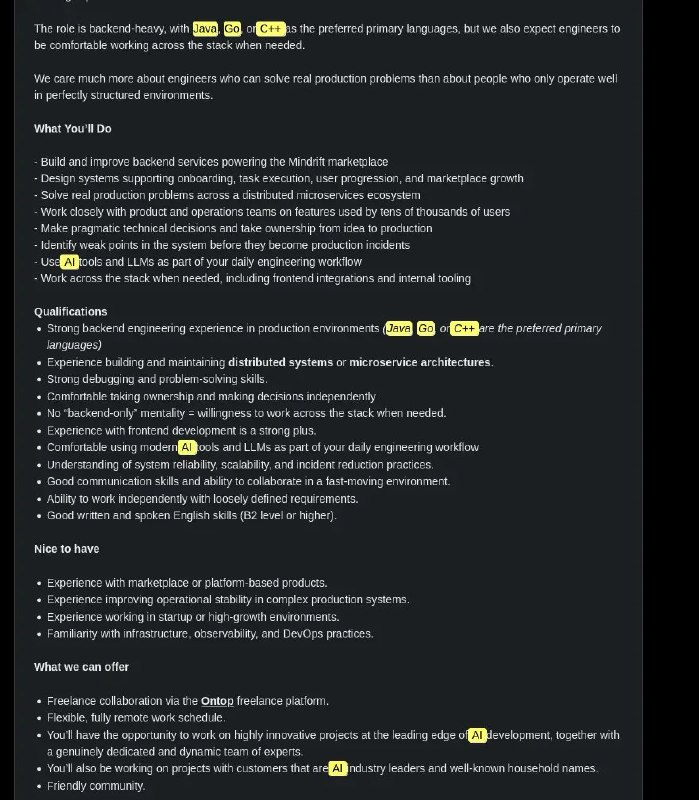
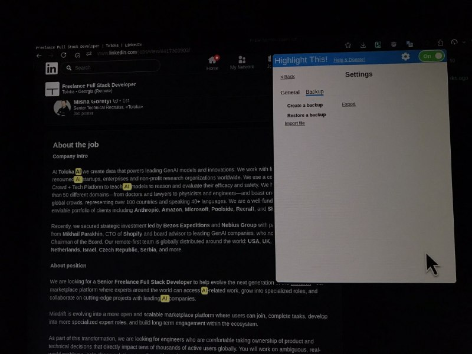
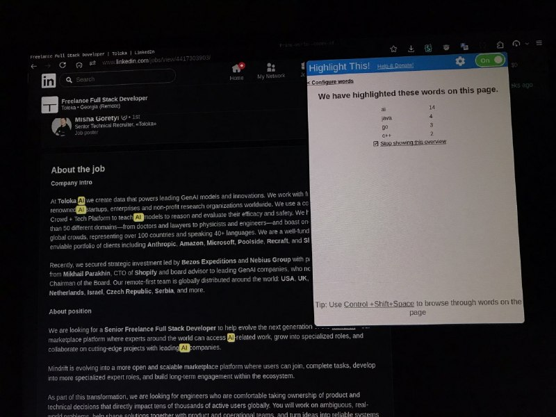
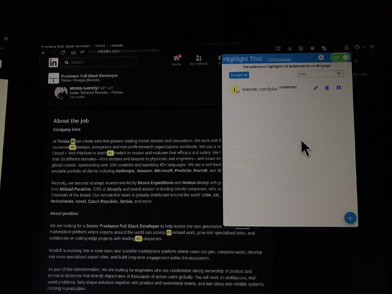
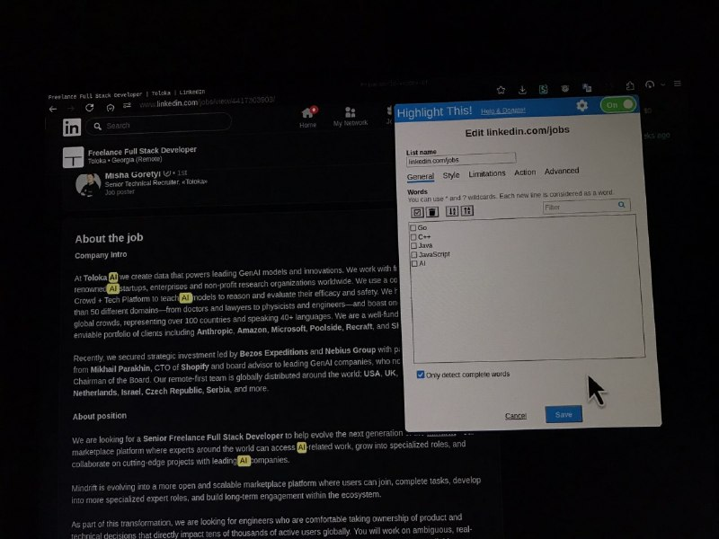
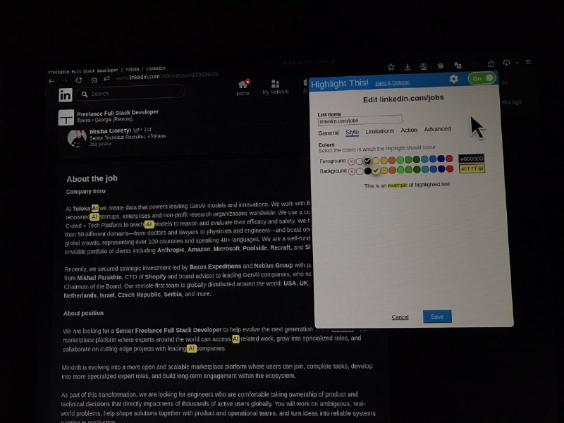
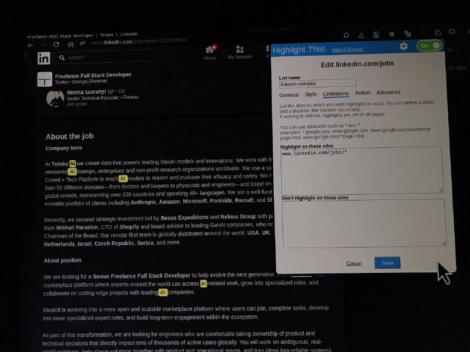
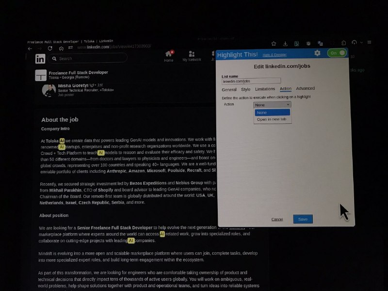
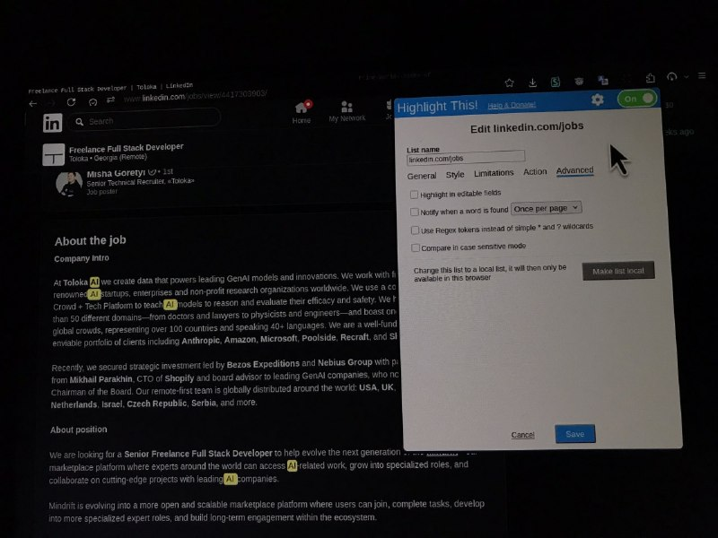
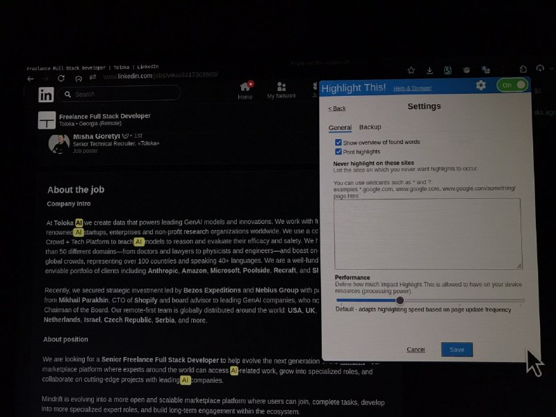

+++
title = "love this extension - highlight predefined list of words, on predefined URLs."
date = 2026-06-10T17:44:03+00:00
description = "love this extension - highlight predefined list of words, on predefined URLs."

[taxonomies]
tags = ["love", "extension", "highlight"]

[extra]
tg_url = "https://t.me/vitaly_zdanevich_chan/1807"
og_image = "01.jpg"
next_id = 1817
next_title = "logo progy github"
prev_id = 1806
prev_title = "Wow, about telegram bots: you can bypass 50 MB response limit - by hosting their bot software."
views = 14
ids = [1807]
+++

<https://addons.mozilla.org/en-US/firefox/addon/highlightthis/>

{{ tag(t="love") }} this {{ tag(t="extension") }} - {{ tag(t="highlight") }} predefined list of words, on predefined URLs.

