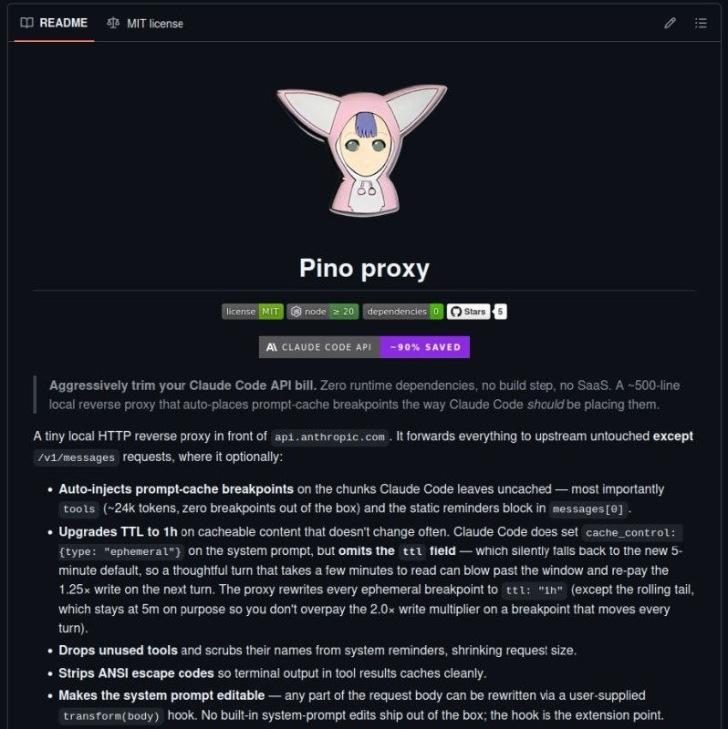

+++
title = "logo progy github"
date = 2026-06-10T18:00:10+00:00
description = "logo progy github Source"

[taxonomies]
tags = ["logo", "progy", "github"]

[extra]
tg_url = "https://t.me/vitaly_zdanevich_chan/1817"
og_image = "5282991447361658515_1230042299_460005011.jpg"
next_id = 1818
next_title = "aws billing cost graph"
prev_id = 1807
prev_title = "love this extension - highlight predefined list of words, on predefined URLs."
views = 12
ids = [1817]
+++

{{ tag(t="logo") }}
{{ tag(t="progy") }}
{{ tag(t="github") }}

[Source](https://www.linkedin.com/posts/alxsuv_claudecode-aiforengineers-softwareengineering-share-7470087035169714176-72AF/)

