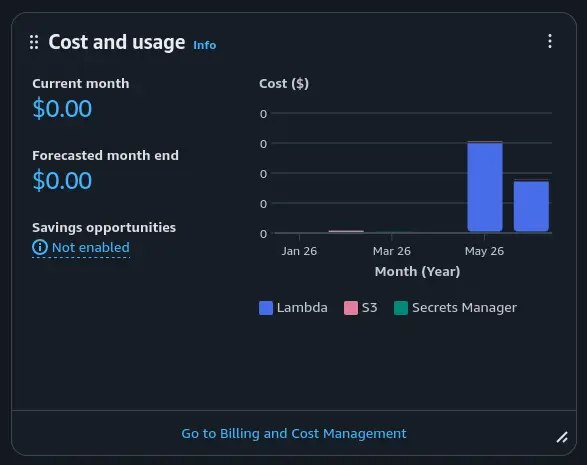

+++
title = "aws billing cost graph"
date = 2026-06-11T21:50:37+00:00
description = "aws billing cost graph"

[taxonomies]
tags = ["aws", "billing", "cost", "graph"]

[extra]
tg_url = "https://t.me/vitaly_zdanevich_chan/1818"
og_image = "5285355242742555081_1230592663_460005833.jpg"
next_id = 1819
next_title = "My another userstyle: for gemini, before and after"
prev_id = 1817
prev_title = "logo progy github"
views = 11
ids = [1818]
+++

{{ tag(t="aws") }}
{{ tag(t="billing") }}
{{ tag(t="cost") }}
{{ tag(t="graph") }}

