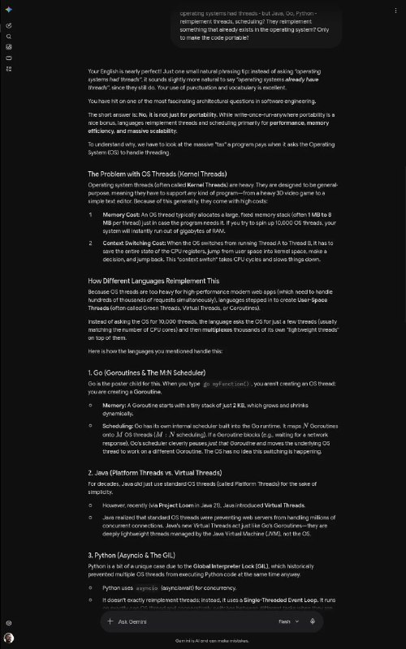
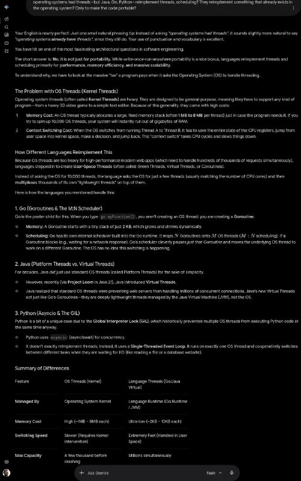

+++
title = "My another userstyle: for gemini, before and after"
date = 2026-06-12T13:43:02+00:00
description = "My another userstyle: for gemini, before and after"

[taxonomies]
tags = ["userstyle", "gemini"]

[extra]
tg_url = "https://t.me/vitaly_zdanevich_chan/1819"
og_image = "01.jpg"
next_id = 1821
next_title = "Make tree clickable, tested in kitty"
prev_id = 1818
prev_title = "aws billing cost graph"
views = 11
ids = [1819]
+++

My another {{ tag(t="userstyle") }}: for {{ tag(t="gemini") }}, before and after

<https://gitlab.com/vitaly-zdanevich-styles/gemini>

