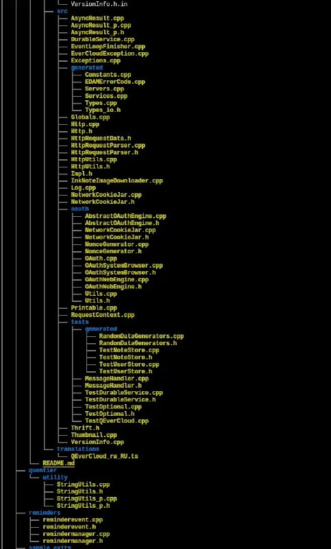

+++
title = ""
date = 2026-06-12T17:21:22+00:00
description = "Make tree clickable, tested in kitty Replace to eza eza --tree --hyperlink With this .config/kitty/open-actions.conf protocol file ext cpp,cc,cxx,c++,hpp,hh,hxx,h++,c,h,java fragmentmatches [0-9]+…"

[taxonomies]
days = ["2026-06-12"]
tags = ["tree", "kitty", "eza"]

[extra]
id = 1821
day = "2026-06-12"
tg_url = "https://t.me/vitaly_zdanevich_chan/1821"
og_image = "5287622628992557020_1231120580_460005340.jpg"
next_id = 1822
next_title = ""
next_body = "#tbc\n#money\nThis is why we have #crypto?"
prev_id = 1819
prev_title = ""
prev_body = "My another #userstyle: for #gemini, before and after"
views = 16
ids = [1821]
+++

Make {{ tag(t="tree") }} clickable, tested in {{ tag(t="kitty") }}  

Replace to {{ tag(t="eza") }}  

```
eza --tree --hyperlink
```

With this `.config/kitty/open-actions.conf`  

```
protocol file
ext cpp,cc,cxx,c++,hpp,hh,hxx,h++,c,h,java
fragment_matches [0-9]+
action launch --type=os-window -- vim +$FRAGMENT -- $FILE_PATH

protocol file
ext cpp,cc,cxx,c++,hpp,hh,hxx,h++,c,h,java
action launch --type=os-window -- vim -- $FILE_PATH

protocol file
mime text/*
fragment_matches [0-9]+
action launch --type=overlay -- vim +$FRAGMENT -- $FILE_PATH

protocol file
mime text/*
action launch --type=overlay -- vim -- $FILE_PATH

protocol file
mime image/*
action launch --type=overlay kitten icat --hold -- $FILE_PATH
```


