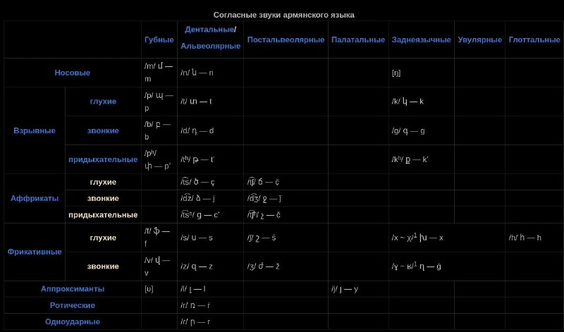

+++
title = "Армянский язык"
date = 2026-06-13T16:39:45+00:00
description = "Армянский язык wikipedia armenian ruwiki language table"

[taxonomies]
tags = ["wikipedia", "armenian", "ruwiki", "language", "table"]

[extra]
tg_url = "https://t.me/vitaly_zdanevich_chan/1824"
og_image = "5289874428806242056_1231644868_460005128.jpg"
next_id = 1825
next_title = "hover balloon with type definition ftplugin/java.vim, with coc"
prev_id = 1823
prev_title = "love my mg alias - clickable grep in kitty - opens file and line in Vim"
views = 14
ids = [1824]
+++

[Армянский язык](https://ru.wikipedia.org/wiki/%D0%90%D1%80%D0%BC%D1%8F%D0%BD%D1%81%D0%BA%D0%B8%D0%B9_%D1%8F%D0%B7%D1%8B%D0%BA)

{{ tag(t="wikipedia") }}
{{ tag(t="armenian") }}
{{ tag(t="ruwiki") }}
{{ tag(t="language") }}
{{ tag(t="table") }}

