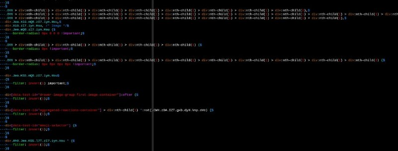

+++
title = ""
date = 2026-06-15T20:46:35+00:00
description = "When css is minified - so what can I do with that :( Leave comments in such userstyle"

[taxonomies]
days = ["2026-06-15"]
tags = ["css", "userstyle"]

[extra]
id = 1832
day = "2026-06-15"
tg_url = "https://t.me/vitaly_zdanevich_chan/1832"
og_image = "5296434402940363365_1233172231_460005989.jpg"
next_id = 1833
next_title = ""
next_body = "#old\n#grandmother\n#religion\n#greatschema\n#candle\nSee also\nFrom"
prev_id = 1831
prev_title = ""
prev_body = "#anime\n#phones\n#evangelion\nFrom"
views = 15
ids = [1832]
+++

When {{ tag(t="css") }} is minified - so what can I do with that :(  

Leave comments in such {{ tag(t="userstyle") }}

