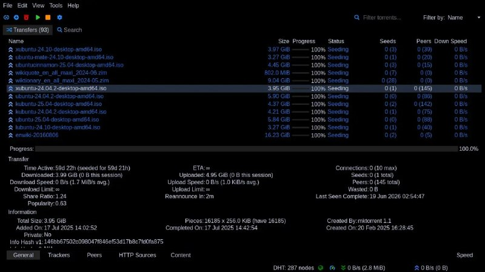

+++
title = ""
date = 2026-06-19T20:30:10+00:00
description = "I did kvantum/qt6 theme, with llm gpt 5.5 xhigh, love it, black On the screenshot - qbittorrent."

[taxonomies]
days = ["2026-06-19"]
tags = ["kvantum", "qt6", "llm", "gpt", "love", "black", "qbittorrent"]

[extra]
id = 1845
day = "2026-06-19"
tg_url = "https://t.me/vitaly_zdanevich_chan/1845"
og_image = "5310306782234219979_1236402146_460002763.jpg"
next_id = 1846
next_title = ""
prev_id = 1844
prev_title = ""
views = 10
ids = [1845]
+++

I did {{ tag(t="kvantum") }}/{{ tag(t="qt6") }} theme, with {{ tag(t="llm") }} {{ tag(t="gpt") }} 5.5 xhigh, {{ tag(t="love") }} it, {{ tag(t="black") }}  

On the screenshot - {{ tag(t="qbittorrent") }}.  

<https://github.com/vitaly-zdanevich/kvantum>  

<https://github.com/microcai/gentoo-zh/tree/master/x11-themes/kvantum-black>

