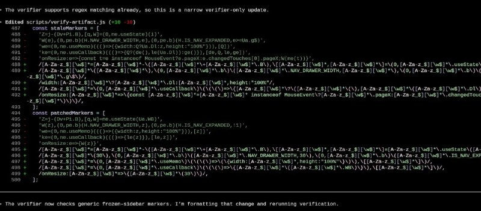

+++
title = "llm codex regex"
date = 2026-06-21T22:44:17+00:00
description = "llm codex regex"

[taxonomies]
tags = ["llm", "codex", "regex"]

[extra]
tg_url = "https://t.me/vitaly_zdanevich_chan/1849"
og_image = "5317060712796460834_1237974668_460003106.jpg"
next_id = 1850
next_title = "Моя лекция про мой Telegram бот YouTube, с поиском, который возвращает аудио"
prev_id = 1848
prev_title = "Oh my, I live here"
views = 9
ids = [1849]
+++

{{ tag(t="llm") }}
{{ tag(t="codex") }}
{{ tag(t="regex") }}

