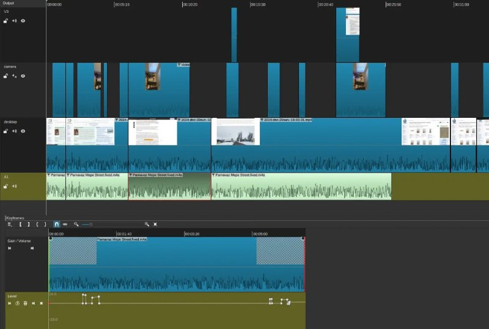

+++
title = ""
date = 2026-06-24T01:06:49+00:00
description = "llm wow of today 1) Fixed broken audio recording - when the iPhone turned off 2) I put this audio to the shotcut video editor - and said - sync cuts and keyframe dots"

[taxonomies]
days = ["2026-06-24"]
tags = ["llm", "shotcut"]

[extra]
id = 1853
day = "2026-06-24"
tg_url = "https://t.me/vitaly_zdanevich_chan/1853"
og_image = "5321338641957199181_1238970701_460004685.jpg"
next_id = 1854
next_title = ""
next_body = "#llm did big #telegram #stickers, even the #pullrequest\nThe patch."
prev_id = 1852
prev_title = ""
prev_body = "what a #stickerpack"
views = 10
ids = [1853]
+++

{{ tag(t="llm") }} wow of today  
1) Fixed broken audio recording - when the iPhone turned off  
2) I put this audio to the {{ tag(t="shotcut") }} video editor - and said - sync cuts and keyframe dots

