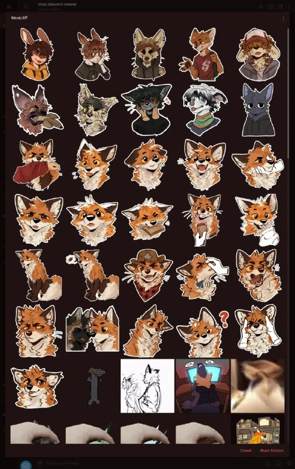

+++
title = "llm did big telegram stickers, even the pull_request"
date = 2026-06-24T06:15:16+00:00
description = "llm did big telegram stickers, even the pullrequest The patch."

[taxonomies]
tags = ["llm", "telegram", "stickers", "pull_request"]

[extra]
tg_url = "https://t.me/vitaly_zdanevich_chan/1854"
og_image = "5323590441770885237_1239494989_460005493.jpg"
next_id = 1855
next_title = "armies_of_exigo it own by electronic_arts"
prev_id = 1853
prev_title = "llm wow of today"
views = 6
ids = [1854]
+++

{{ tag(t="llm") }} did big {{ tag(t="telegram") }} {{ tag(t="stickers") }}, even the {{ tag(t="pull_request") }} <https://github.com/telegramdesktop/tdesktop/issues/4117>

[The patch](https://gitlab.com/vitaly-zdanevich-configs/gentoo--etc-portage--thinkpad-t430/-/blob/amd/patches/net-im/telegram-desktop/large-adaptive-sticker-preview.patch).

