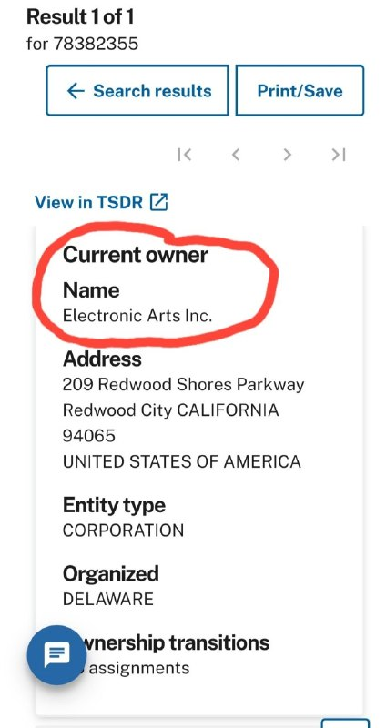

+++
title = ""
date = 2026-06-24T06:16:27+00:00
description = "armiesofexigo it own by electronicarts Твёрдо и чётко."

[taxonomies]
days = ["2026-06-24"]
tags = ["armies_of_exigo", "electronic_arts"]

[extra]
id = 1855
day = "2026-06-24"
tg_url = "https://t.me/vitaly_zdanevich_chan/1855"
og_image = "5323590441770885239_1239494989_460005495.jpg"
next_id = 1856
next_title = ""
next_body = "#armiesofexigo\n#tool\nСофт\nТам к софту есть инструкции но вот еще своими словами написал\nв файле list.LST все пути к игровым файлам\n===\nчтобы извлечь все файлы в консоли:\n\"tools/ork/orkdumper/orkdec\" Data.ork list.LST\n===\nчтобы заменить файл в игре на примере диалога выбора персонажа:\n1. создаем любой файл .LST пусть test.LST в папке с игрой\n2. в нем пишем список файлов которые хотим заменить (каждый с новой строки). Например:\nsoundbeastsbwkrselect01.ogg\n4. в папке с игрой по этому пути (soundbeastsbwkrselect01.ogg) вставляем новый файл на замену\n5. в консоли:\n\"tools/ork/orkcompiler/orkcmp\" -g DataX.ork test.LST\n6. в папке с игрой появится файл DataX.ork переименовываем его в Data3.ork\n7. все"
prev_id = 1854
prev_title = ""
prev_body = "#llm did big #telegram #stickers, even the #pullrequest\nThe patch."
views = 13
ids = [1855]
+++

{{ tag(t="armies_of_exigo") }} it own by {{ tag(t="electronic_arts") }}  

Твёрдо и чётко.  

<https://tmsearch.uspto.gov/search/search-results/78382355>

