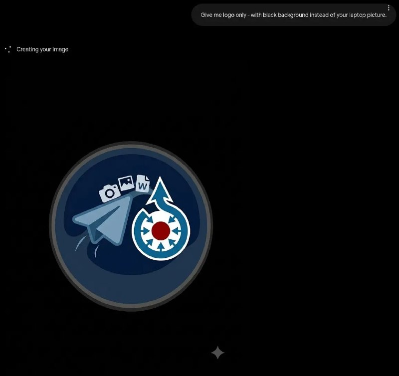

+++
title = ""
date = 2026-06-25T16:33:38+00:00
description = "Wow, Gemini generates good logos, tried it for the first time gemini logo telegrambot wikimediacommons"

[taxonomies]
days = ["2026-06-25"]
tags = ["gemini", "logo", "telegram_bot", "wikimedia_commons"]

[extra]
id = 1865
day = "2026-06-25"
tg_url = "https://t.me/vitaly_zdanevich_chan/1865"
og_image = "01.jpg"
next_id = 1867
next_title = ""
next_body = "#movie\n#blackandwhite\n#faust\n#year1926\nВ этом году фильм «Фауст», знаменитый шедевр немецкого экспрессионизма, отмечает свое 100-летие. Основанный на легенде о Фаусте и драме Иоганна Вольфганга фон Гёте, это был один из самых амбициозных фильмов эпохи Веймарской республики. Созданный компанией UFA (режиссер Ф. В. Мурнау) за примерно 2 миллиона марок и снятый в течение шести месяцев, это был один из самых дорогих и технически сложных немецких фильмов своего времени, новаторский в плане визуальных эффектов, которые остаются впечатляющими и спустя столетие.\nSource"
prev_id = 1864
prev_title = ""
prev_body = "And another #bash #alias:\n# Better word movement: treat aaabbbccc as ONE word\n# Ctrl + Left → move left by \"word\" (including underscores)\n# Ctrl + Right → move right by \"word\" (including underscores)\nif [[ $- == i ]]; then\nbind '\"e[1;5D\": shell-backward-word' # Ctrl + Left Arrow\nbind '\"e[1;5C\": shell-forward-word' # Ctrl + Right Arrow\nfi"
views = 19
ids = [1865]
+++

**Wow, Gemini generates good logos, tried it for the first time**  

{{ tag(t="gemini") }}  
{{ tag(t="logo") }}  
{{ tag(t="telegram_bot") }}  
{{ tag(t="wikimedia_commons") }}

