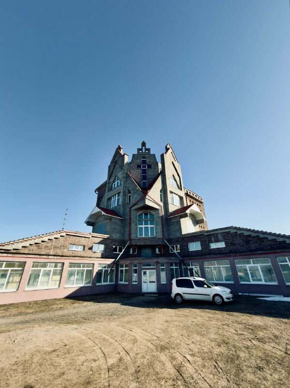

+++
title = ""
date = 2026-06-29T22:35:27+00:00
description = "belarus колодищи architecture church Author: Димитров Денис Source"

[taxonomies]
days = ["2026-06-29"]
tags = ["belarus", "колодищи", "architecture", "church"]

[extra]
id = 1870
day = "2026-06-29"
tg_url = "https://t.me/vitaly_zdanevich_chan/1870"
og_image = "5339406624478667762_1243177481_460006386.jpg"
next_id = 1871
next_title = ""
next_body = "#death\n#grandmother\n#drink\n#kitchen\n#spirit\nSource"
prev_id = 1869
prev_title = ""
prev_body = "#clown\n#mime\nSource"
views = 9
ids = [1870]
+++

{{ tag(t="belarus") }}  
{{ tag(t="колодищи") }}  
{{ tag(t="architecture") }}  
{{ tag(t="church") }}  

Author: [Димитров Денис](https://commons.wikimedia.org/w/index.php?title=User:%D0%94%D0%B8%D0%BC%D0%B8%D1%82%D1%80%D0%BE%D0%B2_%D0%94%D0%B5%D0%BD%D0%B8%D1%81&amp;action=edit&amp;redlink=1)  

[Source](https://commons.wikimedia.org/wiki/File:%D0%91%D0%B0%D0%BF%D1%82%D0%B8%D1%81%D1%82%D1%81%D0%BA%D0%B8%D0%B9_%D1%85%D1%80%D0%B0%D0%BC_%D0%9A%D0%BE%D0%BB%D0%BE%D0%B4%D0%B8%D1%89%D0%B8_IMG_4666.jpg)

