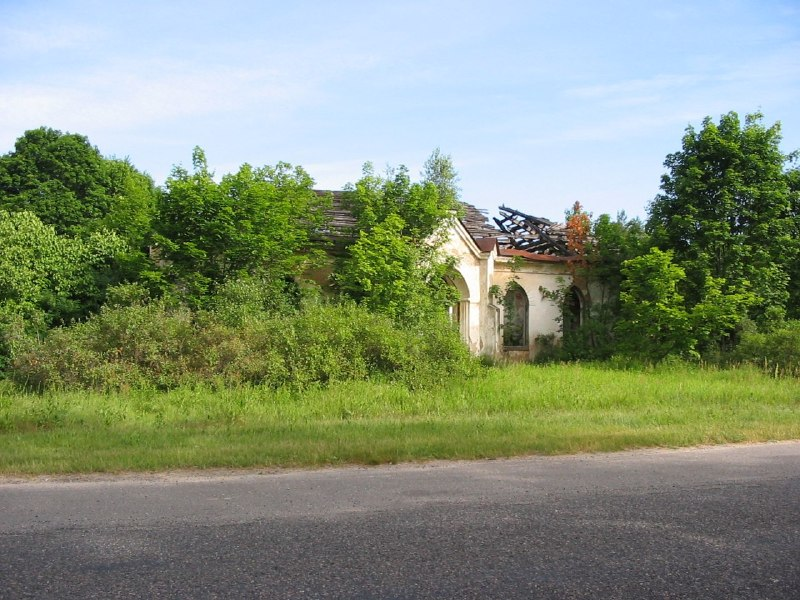
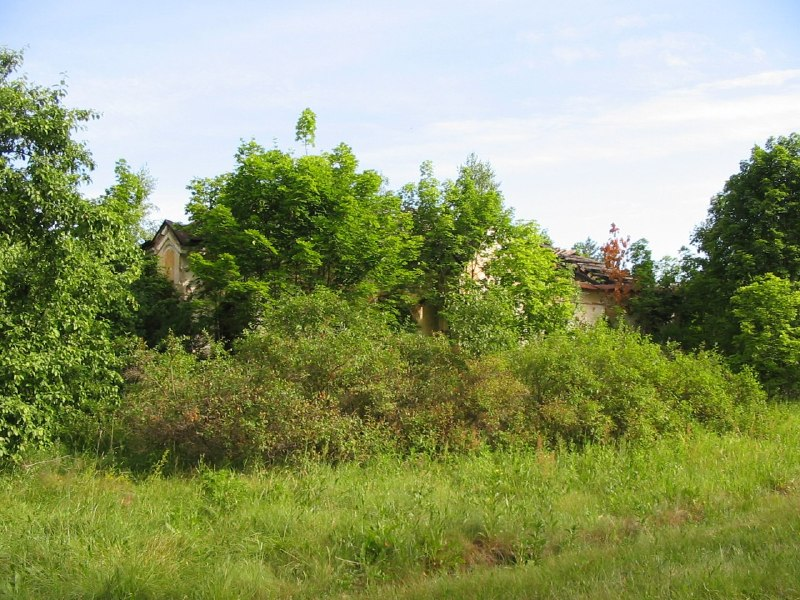
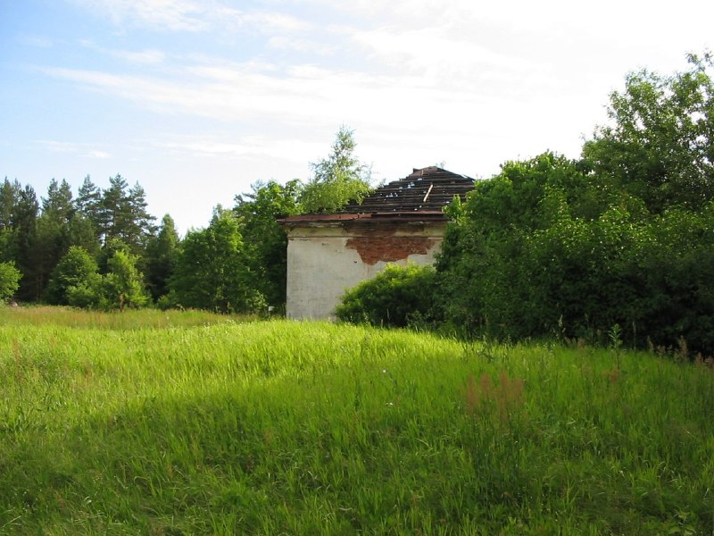

+++
title = ""
date = 2026-07-03T01:06:56+00:00
description = "belarus photo abandone year2005 globustut Source"

[taxonomies]
days = ["2026-07-03"]
tags = ["belarus", "photo", "abandone", "year_2005", "globustut"]

[extra]
id = 1882
day = "2026-07-03"
tg_url = "https://t.me/vitaly_zdanevich_chan/1882"
og_image = "01.jpg"
prev_id = 1881
prev_title = ""
prev_body = "Моя #лекция про мой #telegrambot для #rutracker - не только ищет но и скачивает, на #oraclecloud\nОбзор, и про техническую реализацию.\nSource\nEvernote"
views = 3
ids = [1882]
+++

{{ tag(t="belarus") }}  
{{ tag(t="photo") }}  
{{ tag(t="abandone") }}  
{{ tag(t="year_2005") }}  
{{ tag(t="globustut") }}

[Source](https://commons.wikimedia.org/wiki/File:061-0005_%D0%90%D1%80%D1%82%D1%8B%D1%87%D0%B0%D0%BD%D0%BA%D0%B0,_%D1%81%D0%BD%D1%8F%D1%82%D0%BE_1_%D0%B8%D1%8E%D0%BB%D1%8F_2005.jpg)

